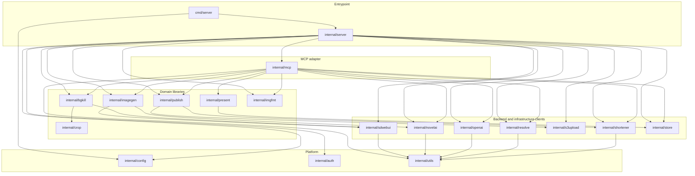

# AGENTS.md

## PLAN.md files

Any "large" work needs a `_PLAN.md` prefixed file in `docs/plans`. "Large" is defined as anything that has more than
two implementation units. An implementation unit is a self-contained piece of work that has clear review signals and
is usually what would be implemented as one pull request. However, do not commit, create pull requests, or do any `git`
write operations without explicit instructions.

When making changes, you must always read the plans first. You may need to update them. Do not update `docs/plans/done`
however, as these files are historical record and can be deleted at any time. You may read them when you believe them
to be relevant. Use done plans as secondary reference for how to create new plans if this `AGENTS.md` file does not
specify updated ways to do the same thing.

Plan documents must have implementation units that are self-contained and could be reviewable by themselves and make
sense to do so. Each must have verifiable, specific, and complete acceptance criteria, focusing on correctness. Make
consideration of non-functional requirements such as security, performance, and maintainability, and look for ways to
test everything for confidence. Some tests will need to be completed by the human; mark where this is the case.

Move plans to done when they are done, even without full human verification completed. When AC are finished, you must
also mark those too as complete.

## Output

Do not give caveats unless they are actually caveats. Err on the side of not presenting them; only if they are
actually something you expect the user will face in the future. For example, if the user asked you to parse URLs that
go to an img2img call to match Garagefront URLs, do not give a caveat saying this will not work for non-Garagefront
URLs.

Do not remind the user what you've done after you've done it unless they ask; they can see the diff.

## Callables

Functions/methods should be kept short unless doing so would make the code less maintainable/harder to read. "Short"
means "fewer than 100 lines of code" and ideally fewer than 30 lines of code. Do not over-optimise for this.

## Organization

Agents should feel encouraged to break up files into smaller, more focused units with corresponding test files. When
necessary and beneficial to break up a package where certain parts of it are isolated/only small amounts of the API
are needed within the package, do so: create new packages.

A file is considered "very long" at 300 lines of code or more. It is considered "unacceptably long" at 500 or more.
Do not over-optimise, but if a file can be broken up and split into smaller, more focused units, do so at roughly 200+
lines of code, and even if it might influence readability, do so at unacceptably long files.

## Architecture

Arrows point from a package to the packages it imports. Only `internal/server` may import `internal/mcp`; the
libraries below it must not import `internal/mcp` or the MCP SDK. `internal/utils` is the shared leaf and must stay
dependency-free.

If you make changes to the architecture, update this diagram.



## Comments and Docstrings

Do not add comments nor docstrings unless they document something that the code itself does not document. You should
write self-documenting code, which may include making variables and functions, for instance, slightly more verbose
than you would otherwise write. The most useful comments are "why" something is the way it is.

E.g., a docstring should _not_ be added if all it does is describe what its parameters do.

Bias _heavily_ against adding comments and docstring. Comments/docstrings should be necessary only. Test files should
almost never have any comments.

When writing comments, be as succinct as possible. Prefer docstrings to comments when possible.

Comments (not docstrings) should have a newline between it and the code it is commenting on.

Do not use em-dashes. Use a semicolon, colon, or hyphen instead.

Line length limit is not 80 characters for code and comments/docstrings; use 120 characters. If lines cannot be shorter
than 120 characters without making them harder to read, don't shorten them.

## README.md

The README.md should be very high level and, importantly, short. APIdoc, if present, should be used to provide more
detailed information, not the README.md.

## Niche Rules

There must be a space between any ending curly braces by themselves on a line and returns. E.g.,

```go
// bad:

  // ...
}
return nil;

// good:

  // ...
}

return nil
```
