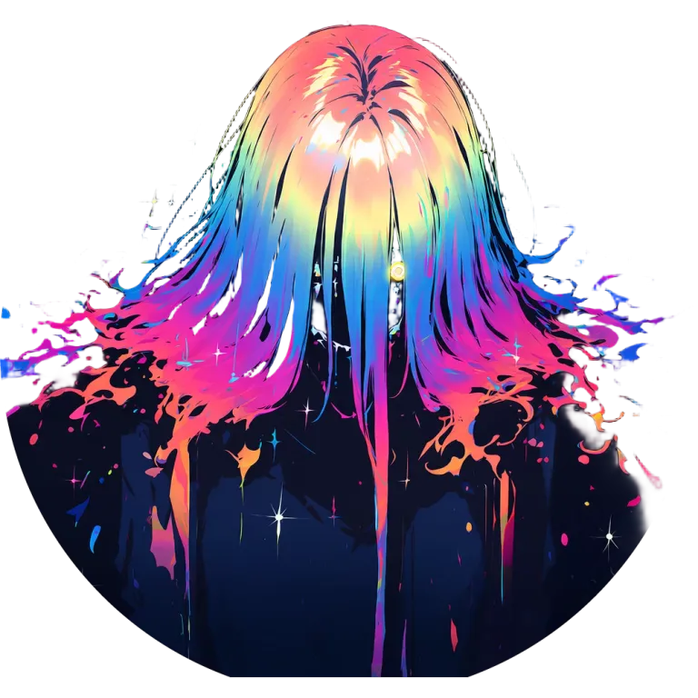

# Neo MCP

A thin MCP wrapper exposing image capabilities to LLM agents. Main functionality leans on SD WebUI Forge.

## Features

Note that the only version of Forge we support is
[Haoming02's fork](https://github.com/Haoming02/sd-webui-forge-classic/tree/neo#stable-diffusion-webui-forge---neo).

- Core feature: `txt2img` and `img2img` tools are implemented with full control of knobs to adjust image generation.
    - They also route to NovelAI when `model` starts with `nai-diffusion-`. Set `NOVELAI_API_KEY` to enable it. Forge-only
      options such as hi-res fix, presets, and VAE/text encoders are ignored for NovelAI requests.
    - With NovelAI enabled, `anlas` reports the account's credit balance and the V5 usage meter.
- Output images are WebP by default. `OUTPUT_FORMAT` sets the format for every tool (`png`, `jpeg`, `jxl`, or `webp`),
  and the `format` input overrides it for a single call. Transparency is kept for every format except JPEG, which
  composites onto white.
- Every call to an image tool stores the image, returns its URL as text, and attaches the image as an MCP image block.
  Image blocks are in the user's and the assistant's audience, so a vision-capable model can see the result.
- `bgkill` removes the background from an image via the
  [`sd-webui-birefnet`](https://github.com/dimitribarbot/sd-webui-birefnet) extension, returning the foreground with a
  transparent background.
- `crop` trims an image to the bounding box of its visible content, then can optionally pad it, centre it on a
  transparent square, or cut it into a circle, which is handy for logos and avatars. It runs locally, so it needs
  neither Forge nor NovelAI.
- `bg` puts an image on a subtle gradient built from a single hex colour and inherits its size from that image,
  so a cut-out from `bgkill` or `crop` gets a backdrop behind it. The gradient direction is random on each call. It also
  runs locally.
- Input URLs are mapped before they are fetched. `IMAGE_URL_MAP` holds comma-separated `public=private` pairs, where
  the private side is either an absolute `http(s)` base URL or a directory to read from, so an agent can pass a URL this
  service cannot reach as it is.
    - A URL under a public key is rewritten before the fetch: with `IMAGE_URL_MAP=https://example.com=http://example:5080`,
      `https://example.com/i/x.png` is fetched from `http://example:5080/i/x.png`. URLs matching no key are fetched
      exactly as written.
    - A directory entry reads a file this service has mounted, which is how an image the user pasted into a chat becomes
      usable as `init_image_url`. Its public key is the only access control for that directory, so make it long and
      unguessable. The private side of an entry is never logged.
- Generated images are written to local disk and returned as URLs served by this service. Set `PUBLIC_HOST` to the base
  URL clients use to reach it, and `FILES_DIR` for where files live (`/data/files` in Docker).
    - Stored files are unguessable and anonymous: anyone holding a URL can open the image, and nobody else can. There
      is no other access control, and every tool call stores the image, returns its URL, and attaches the image block.
    - Mount `FILES_DIR` on a volume to keep files across container replacements.

## Usage

Deploy as a Docker image:

```sh
docker run -d \
  -p 8080:8080 \
  -e API_KEY=change-me \
  -e PUBLIC_HOST=http://192.168.1.10:8080 \
  -e SD_URL=http://host.docker.internal:7860 \
  -v /mnt/user/appdata/neo-mcp:/data \
  ghcr.io/wishmatic/neo-mcp:latest
```

The MCP endpoint is served at `/mcp`; stored images are served from `/i/`.

`/data` holds the image store, so bind-mount a host directory there to keep files across container replacements; the
container runs as uid 65532, so that directory must be writable by it.

All other configuration is optional but strongly recommended; see [.env.example](.env.example).

### SD Web UI Forge Neo's API

You need to turn on the API for SD Web UI Forge Neo for this to work. Add `--api` to your Forge launch command, then
point `SD_URL` at your Forge instance's API.

No support will be provided for any issues related to your installation of Forge, nor the Forge API.

### Authentication

`API_KEY` is required on every `/mcp` request, sent as `Authorization: Bearer <API_KEY>`. Stored images are served
without authentication.

### Agent Model Knowledge

Your agent will need knowledge of VAE and text encoder models as well as available upscalers in order to use them. Add
these verbatim to your system prompt or a skill, along with checkpoints, LoRA, and anything else it needs. The same goes
for NovelAI model ids: no list is maintained here, so the agent supplies them.

### Stored Images

Please see [.env.example](.env.example) for a configuration. Put `PUBLIC_HOST` behind a reverse proxy or CDN if you want
caching; responses are immutable and cacheable.

### Extensions Support

Some extensions I use will be supported over time if they can be called via the Forge API.

Right now, this is only [`sd-webui-birefnet`](https://github.com/dimitribarbot/sd-webui-birefnet), which provides the
`bgkill` tool.

## Warnings

This MCP will be available and maintained so long as I use it, and is built for my own purposes. Extending features via
issue requests and PRs will be _considered_ but unless I find use out of it myself, I probably won't work on those
features.

This is also very bespoke to my use case. I recommend forking this and adjusting features to your needs if it doesn't
quite fit your own.

Current human understanding of this codebase is: 50%.

## License

Neo MCP is licensed under the Apache License, Version 2.0. See [LICENSE](LICENSE).

This project is not affiliated with or endorsed by AUTOMATIC1111, Illyasviel, Haoming02, or any other third-party
services. Those names are trademarks of their respective owners and are used here only to describe compatibility.
