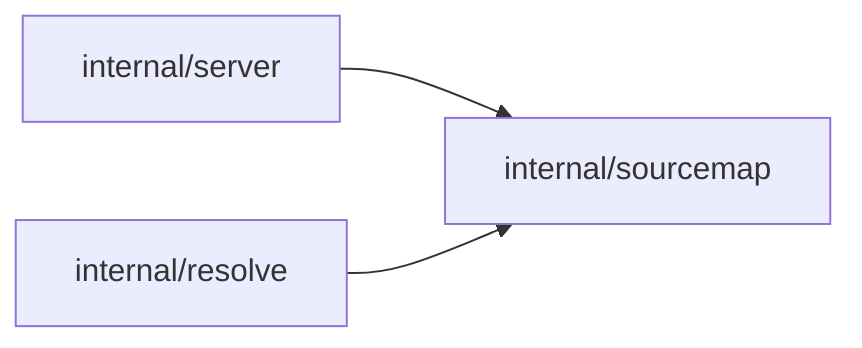

# Image URL Map Plan

Status: not started
Depends on: none
Design source: Elfu's `docs/plans/done/INLINE_URL_SOURCES_PLAN.md` and `internal/sourcemap` in `../elfu-mcp`

## Goal

Let Neo MCP reach the image URLs an agent actually has, by mapping a public URL prefix to somewhere this service can
read it from, for any number of prefixes, configured in one envar:

```sh
IMAGE_URL_MAP=https://example.com=http://example:5080,https://chat.example.com/images/=/data/librechat-data
```

An `img2img` or `bgkill` call whose URL falls under a public key has the key's private side substituted before the
fetch: `https://example.com/i/x.webp` is fetched from `http://example:5080/i/x.webp`, and a URL under a directory key is
read from disk instead of over HTTP. A URL that matches no key is fetched exactly as it is today.

## Where the design comes from

This is Elfu's approach, not one invented here. Elfu (`../elfu-mcp`) implemented it first as `INLINE_URL_MAP` plus
`internal/sourcemap`, and this plan adopts it wholesale: the same envar grammar, the same two kinds of private side, the
same matching rules, the same placement inside `resolve.Resolver.Fetch`, the same error style, and a package of the same
name and shape. Identical dialects are the point: an operator configures both services the same way, and the two
implementations stay easy to converge or share.

Nothing in this plan calls Elfu. Elfu exposes no surface for its map (its HTTP surface is `/mcp`, for the single `inline`
tool, and `/i/`), and a private side is a deployment fact of the service that uses it: Elfu's mounted LibreChat directory
is Elfu's, not Neo's. Each service keeps its own map, and this plan adds no Elfu client and no dependency on Elfu.

## Motivation

Both URL inputs Neo accepts hit the cases this map exists for:

- `init_image_url` and `image_url` are handed whatever URL the user has, including one that cannot be downloaded without
  a session cookie or bearer token, while the same bytes sit on a volume Neo can have mounted. LibreChat's uploaded
  images are the motivating one: the agent asks the user for the URL the chat shows, and Neo reads the file from the
  mounted directory.
- A URL on a public host that does not resolve inside Neo's network, but does resolve under a private name, such as an
  image served by another service on that network (Elfu serves its store under `/i/`, and Elfu already ships
  `https://neo.example.com=http://neo-mcp:8080` as the mirror of this case).

## Scope

In scope:

- The `IMAGE_URL_MAP` envar: comma-separated `public=private` pairs, parsed and validated at startup, failing fast with
  an error that names `IMAGE_URL_MAP`.
- A new leaf package, `internal/sourcemap`, ported from Elfu's: keys, both kinds of private side, longest-prefix
  matching, URL rewriting, and directory reads.
- Applying the map inside `internal/resolve`, per hop, so direct fetches and every redirect hop are covered.
- Documentation: `README.md`, `docs/PROMPT.md`, `.env.example`, and the architecture diagram and leaf rule in `AGENTS.md`.

Out of scope:

- Calling Elfu, reading Elfu's configuration, or sharing a map with it (see above).
- Wildcards, regular expressions, or host-suffix matching. Keys are literal, and a host-wide key is a key with no path.
- Rewriting the URLs Neo returns. `PUBLIC_HOST` behaviour is unchanged, and a `PUBLIC_HOST` URL still reads from the
  local file store.
- Rewriting outbound calls to Forge or NovelAI. `SD_URL` and the NovelAI base URL already point at internal addresses.
- Changing tool descriptions or input schemas. A caller never needs to know that a URL was mapped.
- Preserving the original `Host` header. Rewriting the URL means the private host is what Go sends as `Host`, which suits
  the intended deployments (a service name or IP where the far side does not vhost on the public name). Elfu behaves the
  same way.
- Refreshing the map at runtime. It is fixed for the process lifetime.
- Logging the map. Its private sides are never logged, by design (see below).

## Design

### One envar, two kinds of private side

`IMAGE_URL_MAP` is a plain string, parsed by `sourcemap.Parse`, holding comma-separated `public=private` pairs. The same
grammar as Elfu's `INLINE_URL_MAP`:

```sh
# a path prefix on a public host, read from disk, as LibreChat's images directory mounted into this container
IMAGE_URL_MAP=https://chat.example.com/images/=/data/librechat-data

# a public host, fetched from a private base URL
IMAGE_URL_MAP=https://example.com=http://example:5080
```

- Whitespace around a pair and around both sides of the `=` is trimmed. The split is on the first `=`, so a URL
  containing one is fine on either side.
- Blank entries are skipped, so `IMAGE_URL_MAP=` and a trailing comma mean "no extra pairs" rather than an error, which
  matters because a compose or shell interpolation of an unset variable passes an empty string. An unset, empty, or
  all-blank value means every URL is fetched as it is today.
- A key is an absolute `http` or `https` URL prefix, optionally with a path, and with no query or fragment. Keys are
  unique. A value is either an absolute `http`/`https` base URL, or an absolute directory.
- A malformed pair is a startup error, not a silent skip, since a typo would otherwise surface much later as a fetch
  failure.

### Matching

A URL matches a key when its scheme and host are equal, case-insensitively, and its path starts with the key's path at a
boundary. A path match must be a real boundary: `https://h/img` does not match `https://h/images/x`. The longest matching
path wins, so a specific prefix overrides a host-wide key for the URLs under it. Matching is scheme-sensitive, so
`https://example.com` and `http://example.com` are different keys, and a port is part of the host as written.

### What a match does

- A base URL entry appends the remainder of the path, and the original query, to the private base:
  `https://example.com/images/a.png?x=1` under `https://example.com/images/=http://librechat:3080/images` becomes
  `http://librechat:3080/images/a.png?x=1`. The rewritten URL is what the request is built from.
- A directory entry reads the file instead. The remainder is URL-decoded, cleaned, and joined under the directory. The
  read is refused when the remainder is empty, when it is absolute, when the joined path escapes the directory (checked
  against it the same way the file store checks a key against its own directory), when the extension is not one Neo
  decodes, or when the file exceeds the 32 MiB cap. A refusal is an error, the same as a failed fetch, so the tool
  reports it.
- The extension whitelist is `.png`, `.jpg`, `.jpeg`, `.webp`, and `.jxl`, matching `imgfmt`'s formats. Together with the
  escape check, it is what keeps a mapped directory from becoming an arbitrary local file read.

### Where it is applied

`internal/resolve` is the only component that turns a caller-supplied URL into an outbound request, so it is the only
place that changes, and it changes the same way Elfu's does:

- `resolve.New` gains a third parameter, `sources *sourcemap.Map` (nil and empty both mean "fetch as today"). The one
  production call site in `internal/server`, and the test call sites in `internal/resolve` and `internal/mcp`, are
  updated for the extra argument.
- Inside `Resolver.Fetch`'s existing per-hop loop, immediately after the stored-object short-circuit: a directory match
  returns the file bytes; a base URL match replaces the hop URL with the rewritten target and the loop continues. The
  stored-object check runs first on the unrewritten URL, so a URL on `PUBLIC_HOST` still reads from the local file store
  even when its host is also mapped.
- Because the rewrite happens per hop, a redirect into a mapped prefix is rewritten on that hop too, whether it came from
  an unmapped or a mapped URL. A relative redirect is resolved against the URL of the hop that returned it, as any client
  reaching that URL would.
- Errors and 404 messages name the URL of the hop that failed, which after a rewrite is the rewritten URL. Handlers
  already log the caller's `init_image_url`/`image_url` next to the error, so the original stays traceable.

### The secret that is not a secret

A directory entry hands Neo the ability to read a directory, and nothing authenticates the caller beyond the URL they
supply, so the key being long and unguessable is the operator's whole protection. Two consequences, the same ones Elfu
documents:

- Neo logs the URL it was asked to read, at debug for every call and on failure. A key that is secret can therefore
  appear in this service's logs and in the conversation it came from. It is unguessable, not confidential.
- A base URL entry needs no such property: it is a routing convenience, not a capability.
- The private side of an entry, whether a directory or an internal base URL, is never logged. Nothing about the map is
  logged at startup, and there is no "map enabled" line listing the pairs.

### Config and wiring

- `config.Config` gains `ImageURLMap string` with `env:"IMAGE_URL_MAP"`, carried raw like Elfu carries `INLINE_URL_MAP`.
- `internal/server` parses it with `sourcemap.Parse` next to the existing `PublicBase()` handling, wraps any error as
  `IMAGE_URL_MAP`, and passes the map into `resolve.New`.
- `resolve` gains one dependency, `internal/sourcemap`, in place of nothing today.

### Package layout

`internal/sourcemap` is a leaf: standard library only (`errors`, `fmt`, `net/url`, `os`, `path/filepath`, `strings`), no
imports of other packages in this module, in the spirit of `internal/utils`.



`AGENTS.md` gains those two arrows, and its architecture prose gains `internal/sourcemap` beside `internal/utils` as a
shared leaf that must stay dependency-free.

## Implementation units

### Unit 1: `internal/sourcemap`

Deliverables: `internal/sourcemap/sourcemap.go`, `internal/sourcemap/sourcemap_test.go`, ported from Elfu's with the
same names, signatures, semantics, and error style (`Parse`, `Map`, `Source` with `Kind`, `Lookup`, `Target`, `Read`,
`FilePath`).

Acceptance criteria:

- [ ] `Parse("")`, `Parse(" ")`, `Parse(",")`, and `Parse(" , ")` yield a map that matches nothing.
- [ ] `Parse` accepts both kinds in one spec, and `Lookup` returns the directory source with the path remainder
      (`2026-09/a.png`) and the base URL source with its remainder (`i/x.webp`).
- [ ] `Parse` rejects, each naming the offending entry: no separator, empty private side, empty public side, a key with
      no scheme, a key with a non-http(s) scheme, a relative directory, a query in the private side, and a duplicate key.
- [ ] Longest path wins: with a host-wide key and a path key on the same host, `https://h/i/x.webp` takes the host-wide
      entry and `https://h/images/2026-09/a.png` takes the path entry.
- [ ] Path matching respects boundaries and case: the exact key path matches, a child path matches, `https://h/images/x`
      does not match the key `https://h/img`, and the host matches case-insensitively.
- [ ] The scheme, host, and port are part of the match: other scheme, other host, and other port all miss.
- [ ] `Target` rewrites a host-wide key, rewrites a key with a path prefix, preserves the query, and handles an empty
      remainder.
- [ ] `FilePath` refuses an empty remainder, an absolute path (`/etc/passwd.png`), a traversal
      (`../../etc/passwd.png`), a nested traversal (`a/../../x.png`), an unknown extension (`notes.txt`), and a name with
      no extension; it accepts a nested image path and joins it under the directory.
- [ ] `Read` returns the bytes of a file whose name needs unescaping (`2026-09/a%20b.png`), and refuses a missing file, a
      directory, a file over the cap, and a traversal.
- [ ] `Parse` trims whitespace around the pair and both sides, and the resulting directory is absolute.
- [ ] `go build ./...`, `go vet ./...`, and `go test ./... -race -count=1` pass, and the package imports no other
      package of this module.

### Unit 2: resolving through the map

Deliverables: `internal/resolve/resolver.go`, `internal/resolve/resolver_test.go`, `internal/resolve/input_test.go`,
`internal/config/config.go`, `internal/config/config_test.go`, `internal/server/server.go`, and the `resolve.New` call
sites in `internal/mcp`'s tests.

Acceptance criteria:

- [ ] `resolve.New` takes the map, and a nil or empty map leaves today's behaviour unchanged, with the existing resolver
      tests passing after the extra argument only.
- [ ] A URL under a base URL entry is fetched from the rewritten base, proven by an `httptest` server that stands in for
      the private host and receives the request with the path and query preserved.
- [ ] A URL under a directory entry is read from disk and returned, and no HTTP request is made (assert zero requests on
      the test server).
- [ ] A URL under a directory entry aiming outside the directory, at an unknown extension, or at a file over the cap
      returns an error rather than bytes.
- [ ] A mapped prefix reached by a redirect is rewritten on that hop, from both a mapped and an unmapped start URL.
- [ ] A URL on `PUBLIC_HOST` whose path is `i/...` still reads from the object store when its host is also a key, with no
      request to the test server, so the stored-object short-circuit keeps precedence.
- [ ] `IMAGE_URL_MAP` parses into config, and a malformed value makes `server.New` fail at startup with an error naming
      `IMAGE_URL_MAP`.
- [ ] Nothing about the map is logged at startup.
- [ ] `go build ./...`, `go vet ./...`, and `go test ./... -race -count=1` pass.

### Unit 3: documentation

Deliverables: `README.md`, `docs/PROMPT.md`, `.env.example`, `AGENTS.md`.

Acceptance criteria:

- [ ] `README.md` documents `IMAGE_URL_MAP` with an example of each kind, states that a URL under a key is rewritten
      before it is fetched, and states that a directory entry's key is its only access control, so it must be long.
- [ ] `docs/PROMPT.md` tells the agent it can pass the URL the user pasted straight to the image tools, since the server
      maps URLs it cannot reach.
- [ ] `.env.example` lists `IMAGE_URL_MAP` with a commented example of each kind. This file is excluded from agent
      access, so the edit is a human task.
- [ ] `AGENTS.md`'s diagram adds `internal/sourcemap` with arrows from `internal/server` and `internal/resolve`, and its
      leaf rule names `internal/sourcemap` beside `internal/utils`, checked against `go list`.

## Verification

Per unit, `go build ./...`, `go vet ./...`, and `go test ./... -race -count=1`, as CI runs them, plus `go list -deps`
for the package boundary. The map, the rewrite, the directory reads, and the escape checks are all testable with a temp
directory and an `httptest` server, so the parts that matter are covered without a deployment.

Human checks, marked as such because they need real hosts and mounts:

- [ ] Set `IMAGE_URL_MAP=https://<public-host>=http://<private-host>:<port>` where the private host serves the same
      bytes, call `bgkill` with `image_url=https://<public-host>/i/<key>`, and confirm the image comes back and the
      private host's access log shows the request while the public host sees none. Repeat for `img2img` with
      `init_image_url`.
- [ ] Mount a real LibreChat images directory, paste an image, have the agent pass the URL the chat showed, and confirm
      `img2img` uses it as the init image.

## Open questions

- The envar name. `IMAGE_URL_MAP` describes Neo's inputs (both keys are image URLs); `INLINE_URL_MAP` would match Elfu
  literally but Neo has no `inline` tool. Whichever is chosen should then stay stable, since U5 of Elfu's plan and this
  plan both want the dialects close.
- Whether Neo should accept directory entries at all. The request that started this was public host to private host,
  which a base URL entry alone satisfies; directory entries add local file reads, which is what makes the
  pasted-image case work. They are one mechanism in Elfu's implementation, so they are kept here unless local reads are
  unwanted on Neo.
- Whether the map should ever come from Elfu. Not part of this plan: Elfu publishes no map today, and its private sides
  are local to it, so there is nothing to read.
