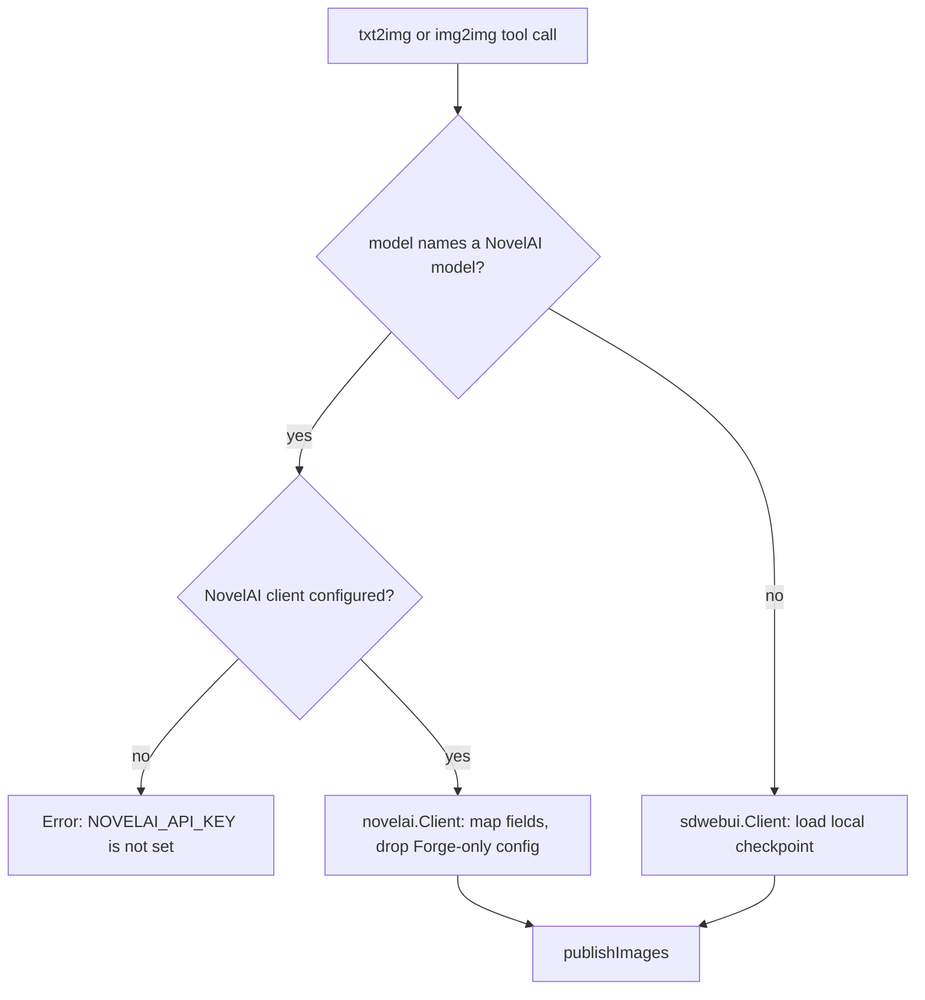

# NovelAI Integration Plan

## Summary

Add NovelAI as a second image-generation backend used by the existing `txt2img` and `img2img` MCP tools. The
`model` argument decides the backend: if it names a NovelAI model, the request is sent to the NovelAI API and no local
Forge checkpoint is loaded; otherwise the request goes to Forge exactly as it does today.

The NovelAI side lives in a new `internal/novelai` package mirroring `internal/sdwebui`. The reference for the
txt2img payload shape is `../staircase/libs/imagegen/src/providers/novelai.ts`.

## Request Routing



## Design Decisions

1. **Same tools, model-name routing.** No `novelai_txt2img` / `novelai_img2img` tools are added. A model id beginning
   with `nai-diffusion-` is routed to NovelAI; anything else is treated as a Forge checkpoint filename, so the agent
   uses the tools exactly as before.
2. **The server does not enumerate or validate models.** The caller/agent is responsible for knowing which NovelAI
   models are available, so the server keeps only the routing prefix and passes the model id through unchanged. New,
   renamed, or per-account models need no code change, and no model list is advertised in the tool schema.
3. **No deprecated-model support.** `nai-diffusion-3` and any other model that does not work through the modern
   endpoints get no special handling, no alternate endpoint, and no ZIP decoding. They match the routing prefix and,
   if the API rejects them, its error is surfaced unmodified.

   The same reasoning applies to samplers: an empty `sampler_name` becomes the NovelAI default, and any non-empty
   value is passed through verbatim rather than checked against a server-side list.
4. **Forge-only configuration is ignored, never an error.** `forge_preset`, `vae_and_text_models`, `scheduler`,
   `enable_hr`, `hr_scale`, `hr_upscaler`, `hr_second_pass_steps`, and `hr_cfg` are dropped from NovelAI requests.
   Hi-res fix in particular has no equivalent on these endpoints, since NovelAI upscaling is a separate operation.
   The presence of any of these fields must not fail the call. They are also not sent, so the API never sees them.
5. **Provider-resolved defaults.** `sampler_name` and `scheduler` schema defaults become empty strings; each backend
   substitutes its own default at request-build time (`DPM++ 2M` / `Automatic` for Forge, `k_euler_ancestral` for
   NovelAI). This avoids the injected Forge default leaking into NovelAI requests.
6. **Field mapping.** Generic fields map to NovelAI names (`cfg_scale` to `scale`, `sampler_name` to `sampler`,
   img2img `denoising_strength` to `strength`).
7. **Response decoding.** The API returns a length-prefixed msgpack stream; the final `image` frame is the result, and
   it is returned as raw PNG bytes so `publishImages` and the S3/shortener behavior are unchanged.
8. **msgpack dependency.** Add `github.com/vmihailenco/msgpack/v5` (v5.4.1) for frame decoding. Hand-rolling a
   decoder would need to skip unknown/extension types correctly, which is error-prone for little gain.

### Parameter mapping

| Tool field | NovelAI parameter |
| --- | --- |
| `model` | top-level `model` |
| `prompt` | top-level `input`, plus `parameters.v4_prompt.caption.base_caption` |
| `negative_prompt` | `parameters.negative_prompt`, plus `parameters.v4_negative_prompt.caption.base_caption` |
| `sampler_name` | `parameters.sampler` (empty becomes `k_euler_ancestral`) |
| `steps` | `parameters.steps` |
| `width`, `height` | `parameters.width`, `parameters.height` |
| `cfg_scale` | `parameters.scale` |
| `seed` | `parameters.seed` (-1 becomes a random uint32) |
| img2img `denoising_strength` | `parameters.strength` |
| img2img `noise` (new field) | `parameters.noise` |

Empty `negative_prompt` falls back to a package-level default negative prompt copied from staircase. In `txt2img`,
`denoising_strength` belongs to hi-res fix and is therefore ignored for NovelAI, unlike the img2img field of the same
name.

## Non-functional Requirements

Security:

- `NOVELAI_API_KEY` is read from the environment only. It is never logged, never returned in a tool result, and never
  included in an error message.
- Image bytes are never logged. The img2img init image is logged as a URL only, matching `img2img` today.
- Non-2xx NovelAI errors are truncated with the existing `utils.ReadLimited` helper before being surfaced, so a large
  upstream body cannot flood the log or the agent.

Performance:

- One HTTP request per tool call; decoding stops at the first `final` frame instead of draining the stream.
- The msgpack frame reader rejects an unreasonable length prefix (cap 64 MiB) before allocating, so a malformed stream
  cannot exhaust memory.
- The init image is passed through as bytes and base64-encoded once, with no intermediate copies beyond what
  `encoding/base64` requires.

Maintainability:

- Routing depends on a single prefix constant, so a NovelAI model becomes usable without touching the server.
- Generated bytes flow through the existing `publishImages`, so S3 upload, shortening, and inline content stay in one
  place.
- `internal/novelai` mirrors `internal/sdwebui` file by file, so the two backends stay easy to compare.

## Package Layout

| Path | Change | Purpose |
| --- | --- | --- |
| `internal/novelai/client.go` | New | Client, `New`, HTTP plumbing, error formatting |
| `internal/novelai/model.go` | New | `IsModel` prefix routing |
| `internal/novelai/params.go` | New | Shared parameter builder, seed resolution, dimension normalization |
| `internal/novelai/stream.go` | New | Length-prefixed msgpack frame decoder |
| `internal/novelai/account.go` | New | Anlas balance lookup |
| `internal/mcp/anlas.go` | New | `anlas` tool |
| `internal/novelai/txt2img.go` | New | `Txt2ImgRequest`, `Txt2Img` |
| `internal/novelai/img2img.go` | New | `Img2ImgRequest`, `Img2Img` |
| `internal/novelai/*_test.go` | New | Unit tests, one file per unit |
| `internal/config/config.go` | Edit | `NOVELAI_API_KEY`, `NOVELAI_URL` |
| `internal/server/server.go` | Edit | Build the NovelAI client, pass it to MCP |
| `internal/mcp/server.go` | Edit | Accept the NovelAI client, gate registration |
| `internal/mcp/handlers.go` | New | Dependency-holding handler struct |
| `internal/mcp/provider.go` | New | Per-provider request mappers |
| `internal/mcp/txt2img.go` | Edit | Route by model |
| `internal/mcp/img2img.go` | Edit | Route by model, add `noise` |
| `internal/mcp/bgkill.go` | Edit | Move the handler into `handlers` |
| `internal/mcp/img2txt.go` | Edit | Move the handler into `handlers` |
| `internal/mcp/shared.go` | Edit | Model description, provider-resolved sampler and scheduler defaults |
| `go.mod`, `go.sum` | Edit | Add `github.com/vmihailenco/msgpack/v5` |
| `.env.example`, `README.md` | Edit | Document NovelAI configuration |

## Units

### Unit 1: Client, model recognition, and shared parameters

**Files:** `internal/novelai/client.go`, `internal/novelai/model.go`, `internal/novelai/params.go`,
`internal/novelai/client_test.go`, `internal/novelai/model_test.go`, `internal/novelai/params_test.go`

**Work:** Add the client, the routing check, and the payload fragment shared by txt2img and img2img.

```go
type Client struct {
    baseURL         string
    apiKey          string
    http            *http.Client
    isVerboseErrors bool
    randomSeed      func() uint32 // overridable in tests
}

func New(baseURL, apiKey string, isVerboseErrors bool) *Client

const modelPrefix = "nai-diffusion-"

func IsModel(model string) bool
```

`IsModel` trims surrounding whitespace and reports whether the result begins with `modelPrefix`. It holds no list of
concrete ids, so `nai-diffusion-4-full.safetensors` and future ids both match.

`params.go` holds `baseParams(model, prompt, negativePrompt, sampler string, steps, width, height int, scale float64,
seed uint32) map[string]any`. It mirrors the staircase payload: `params_version` 3, `n_samples` 1, `noise_schedule`
`karras`, `image_format` `png`, `ucPreset` 0, `qualityToggle` true, `autoSmea` false, `dynamic_thresholding` false,
`controlnet_strength` 1, `legacy` false, `add_original_image` true, `cfg_rescale` 0, `legacy_v3_extend` false,
`skip_cfg_above_sigma` nil, `use_coords` false, `legacy_uc` false, `normalize_reference_strength_multiple` true,
`inpaintImg2ImgStrength` 1, `deliberate_euler_ancestral_bug` false, `prefer_brownian` true, `characterPrompts` empty,
plus `width`, `height`, `scale`, `steps`, `seed`, `sampler`, `negative_prompt`, `v4_prompt`, `v4_negative_prompt`. It
does not include `stream`, `sm`, or `sm_dyn`; txt2img layers `stream: "msgpack"` on top.

Also in this file:

- `defaultNegativePrompt` const, copied verbatim from staircase's `DEFAULT_NEGATIVE_PROMPT`, and `defaultSampler`
  const `k_euler_ancestral`. An empty sampler is replaced with `defaultSampler`.
- `resolveSeed(requested int) uint32`: negative seeds become `randomSeed()` in `[0, 4294967295]`, non-negative seeds
  pass through unchanged.
- `normalizeDimensions(width, height int) (int, int, error)`: round each axis up to the nearest multiple of 64, floor
  at 64, and error when total pixels exceed 3047424 or fall below 4096.
- `httpError(method, path string, resp *http.Response) string` mirroring `sdwebui.Client.httpError`.

**Acceptance criteria**

- AC-1.1: `New("https://image.novelai.net/", "sk-x", false)` stores the base URL without the trailing slash and the
  key, and `New` accepts an empty key.
- AC-1.2: `IsModel` is true for `nai-diffusion-5-full`, `nai-diffusion-4-full`, `nai-diffusion-5-anime`,
  `nai-diffusion-furry-3`, and an unknown future id such as `nai-diffusion-9-experimental`.
- AC-1.3: `IsModel` is false for `""`, `sd_xl_base_1.0.safetensors`, `nai_diffusion_5_full`, and
  `model-nai-diffusion-5-full`; surrounding whitespace is ignored so `"  nai-diffusion-5-full  "` is true.
- AC-1.4: No concrete NovelAI model id appears in non-test code; routing is the single `modelPrefix` constant.
- AC-1.5: The txt2img parameter map has `params_version` 3, `stream` `"msgpack"`,
  `width`/`height`/`steps`/`scale`/`seed` matching the inputs, `v4_prompt.caption.base_caption` equal to the prompt,
  and no `sm` or `sm_dyn` key.
- AC-1.6: With an empty negative prompt, `negative_prompt` and `v4_negative_prompt.caption.base_caption` both equal
  `defaultNegativePrompt`; with a supplied negative prompt, both equal it.
- AC-1.7: An empty sampler becomes `k_euler_ancestral`; any non-empty sampler, including an id the server does not
  know, is used verbatim.
- AC-1.8: `resolveSeed(-1)` returns a value in `[0, 4294967295]` (assert against a stubbed `randomSeed` and against
  the real one), and `resolveSeed(42)` returns 42.
- AC-1.9: `normalizeDimensions(833, 1217)` returns `896, 1280` and `normalizeDimensions(64, 64)` succeeds; `normalizeDimensions(0, 0)`,
  `normalizeDimensions(-64, 512)`, and `normalizeDimensions(4096, 4096)` error.
- AC-1.10: A non-2xx response produces an error containing the status code, and, when `isVerboseErrors` is set, a
  truncated response body.

**Human verification:** HV-1 and HV-2 confirm prefix routing and sampler passthrough against the live API.

### Unit 2: msgpack stream decoder

**Files:** `internal/novelai/stream.go`, `internal/novelai/stream_test.go`

**Work:** Implement `decodeFinalImage(r io.Reader) ([]byte, error)`:

1. Read a 4-byte big-endian frame length.
2. Reject a length above the 64 MiB cap before allocating.
3. Read exactly that many bytes and msgpack-decode them into a struct with `event_type` and an image value that may be
   `bin` bytes or a base64 `str`.
4. Return the bytes when `event_type == "final"`, otherwise continue.
5. Error with `"novelai stream ended without producing an image"` on clean EOF with no final frame, and a distinct
   error for a truncated frame or an unreasonable length prefix.

**Acceptance criteria**

- AC-2.1: A stream containing one final frame with a `bin` image returns those exact bytes.
- AC-2.2: A stream containing one final frame with a base64 `str` image returns the decoded bytes.
- AC-2.3: Intermediate frames followed by a final frame return the final image.
- AC-2.4: Two concatenated frames each containing a final image return the first final image.
- AC-2.5: A frame with a length prefix larger than the remaining bytes returns an error (not a panic, not a partial
  image).
- AC-2.6: A clean EOF with no frames returns the exact error string above.
- AC-2.7: An all-intermediate stream returns the same error string.
- AC-2.8: A frame length above the 64 MiB cap returns an error without allocating a buffer of that size.

### Unit 3: NovelAI txt2img

**Files:** `internal/novelai/txt2img.go`, `internal/novelai/txt2img_test.go`

**Work:** Add:

```go
type Txt2ImgRequest struct {
    Model          string
    Prompt         string
    NegativePrompt string
    Sampler        string
    Steps          int
    Width          int
    Height         int
    Scale          float64
    Seed           int
}

func (c *Client) Txt2Img(ctx context.Context, req Txt2ImgRequest) ([][]byte, error)
```

POST `{base}/ai/generate-image-stream` with `{"input": prompt, "model": model, "action": "generate", "parameters":
{...}}`, the `Authorization: Bearer <key>` and `Content-Type: application/json` headers, then decode with
`decodeFinalImage`.

**Acceptance criteria**

- AC-3.1: The request path is `/ai/generate-image-stream`, the `Authorization` header is `Bearer <key>`, and
  `Content-Type` is `application/json`.
- AC-3.2: The decoded body has `action` `"generate"`, `model` equal to the request model, `input` equal to the prompt,
  and `parameters.stream` equal to `"msgpack"`.
- AC-3.3: A server returning an encoded final frame yields a one-element `[][]byte` containing the frame's image bytes.
- AC-3.4: A `500` response with a body returns an error containing the status and a truncated body.
- AC-3.5: Cancelling the request context returns an error rather than hanging.

### Unit 4: NovelAI img2img

**Files:** `internal/novelai/img2img.go`, `internal/novelai/img2img_test.go`

**Work:** Add:

```go
type Img2ImgRequest struct {
    Model          string
    Prompt         string
    NegativePrompt string
    Sampler        string
    Steps          int
    Width          int
    Height         int
    Scale          float64
    Seed           int
    InitImage      []byte
    Strength       float64
    Noise          float64
}

func (c *Client) Img2Img(ctx context.Context, req Img2ImgRequest) ([][]byte, error)
```

POST `{base}/ai/generate-image-stream` with `action` `"img2img"` and the shared parameters extended with `image` (raw
standard base64, no `data:` prefix), `strength`, `noise`, and `extra_noise_seed`. Do not set `parameters.stream`; it
only controls intermediate-step streaming.

**Acceptance criteria**

- AC-4.1: The path is `/ai/generate-image-stream` and `action` is `"img2img"`.
- AC-4.2: `parameters.image` is the raw base64 of the init image and does not start with `data:`.
- AC-4.3: `parameters.strength` equals the request strength and `parameters.noise` equals the request noise, including
  an explicit `0`.
- AC-4.4: `parameters.extra_noise_seed` is present and within `[0, 4294967295]`.
- AC-4.5: The payload has no `stream`, `sm`, or `sm_dyn` key.
- AC-4.6: A final frame response yields the image bytes.

### Unit 5: Configuration and documentation

**Files:** `internal/config/config.go`, `internal/config/config_test.go`, `.env.example`, `README.md`

**Work:** Add `NovelAIAPIKey string \`env:"NOVELAI_API_KEY"\`` and
`NovelAIURL string \`env:"NOVELAI_URL" envDefault:"https://image.novelai.net"\``. Document both in `.env.example`
under a "NovelAI (optional)" heading that states NovelAI is disabled without a key. Add a short NovelAI section to
the README covering the key and that NovelAI models are selected through the `model` argument; the agent supplies the
model id, and Forge-only options are ignored for NovelAI.

**Acceptance criteria**

- AC-5.1: `Load` with `NOVELAI_URL` unset yields `https://image.novelai.net`; with it set, yields that value.
- AC-5.2: `Load` reads `NOVELAI_API_KEY` into the new field.
- AC-5.3: The default test unsets `NOVELAI_URL` and restores the previous value; the override test uses `t.Setenv`.
- AC-5.4: `.env.example` lists `NOVELAI_API_KEY` and `NOVELAI_URL`.
- AC-5.5: The README has a NovelAI section of at most a short paragraph, states that model ids come from the agent,
  and does not list models.

### Unit 6: Server wiring

**Files:** `internal/server/server.go`, `internal/mcp/server.go`, `internal/mcp/server_test.go`

**Work:** Build the NovelAI client in `server.New` when `cfg.NovelAIAPIKey != ""`, log whether it is enabled (without
the key), and pass it to `mcp.New`. `mcp.New` and `registerTools` already take the resolver and OpenAI clients, so add
`novelaiClient *novelai.Client` between `sdClient` and `uploader`; the resulting signature is
`New(log, sdClient, novelaiClient, uploader, shortenerClient, resolver, openaiClient)`. Register `txt2img` and `img2img`
when either generation client is present, `bgkill` only when the Forge client is present, and leave `img2txt` gated on
the OpenAI client.

**Acceptance criteria**

- AC-6.1: `server.New` with `NOVELAI_API_KEY` set and an otherwise valid config returns no error.
- AC-6.2: `mcp.New(log, nil, novelaiClient, nil, nil, nil, nil)` registers `txt2img`, `img2img`, and `anlas` but not
  `bgkill`, verified by listing tools over an in-memory MCP transport.
- AC-6.3: `mcp.New(log, forgeClient, nil, nil, nil, nil, nil)` still registers `txt2img`, `img2img`, and `bgkill`.
- AC-6.4: `mcp.New(log, nil, nil, nil, nil, nil, nil)` registers no tools and returns no error.
- AC-6.5: `mcp.New(log, nil, nil, nil, nil, nil, openaiClient)` still registers `img2txt` as it does today.
- AC-6.6: The "NovelAI enabled" log line does not contain the API key.

### Unit 7: MCP handler refactor, routing, and schemas

**Files:** `internal/mcp/handlers.go` (new), `internal/mcp/provider.go` (new), `internal/mcp/txt2img.go`,
`internal/mcp/img2img.go`, `internal/mcp/bgkill.go`, `internal/mcp/img2txt.go`, `internal/mcp/shared.go`,
`internal/mcp/shared_test.go`, `internal/mcp/img2txt_test.go`, `internal/mcp/provider_test.go`

**Work:**

1. Introduce `type handlers struct` holding `log`, `forge *sdwebui.Client`, `novelai *novelai.Client`, `uploader`,
   `shortener`, `resolver`, and `openai *openai.Client`, with `txt2img`, `img2img`, `bgkill`, and `img2txt` methods.
   `runImg2Txt` becomes the `img2txt` method so every handler has the same shape, and `register*` functions become thin
   `mcp.AddTool` wrappers around those methods, which keeps the handlers directly unit testable without an MCP
   client.
2. Add request mappers in `provider.go`:
   - `forgeTxt2Img(in)`, `forgeImg2Img(in, data)` (present behavior, substituting `DPM++ 2M` / `Automatic` when the
     sampler or scheduler is empty).
   - `novelaiTxt2Img(in)`, `novelaiImg2Img(in, data)`, which map the shared fields, drop every Forge-only field, and
     never return a validation error.
3. Route in each handler: `novelai.IsModel(in.Model)` selects NovelAI, and a nil NovelAI client becomes an error
   naming `NOVELAI_API_KEY`.
4. Schema changes:
   - Change the `model` description in `shared.go` to state that a value starting with `nai-diffusion-` selects the
     NovelAI backend and that the agent is responsible for supplying a valid model id. Set no `enum`.
   - Set the `sampler_name` and `scheduler` defaults to `""`.
   - Add `noise` to `img2imgInput` (default 0), documented as NovelAI-only and ignored by Forge.
5. Log lines keep the existing shape and add a `provider` field (`forge` or `novelai`).

**Acceptance criteria**

- AC-7.1: A call with `model` `"nai-diffusion-5-full"` hits only an httptest NovelAI server; a recording Forge
  httptest server receives no request.
- AC-7.2: A call with `model` `"sd_xl_base_1.0.safetensors"` hits only the Forge server.
- AC-7.3: A NovelAI model with no NovelAI client returns an error containing `NOVELAI_API_KEY` and makes no HTTP
  request.
- AC-7.4: A NovelAI call that also sets `enable_hr`, `hr_scale`, `hr_upscaler`, `hr_second_pass_steps`, `hr_cfg`,
  `forge_preset`, `vae_and_text_models`, and `scheduler` succeeds, and the NovelAI payload contains none of those
  keys; no error is returned for their presence.
- AC-7.5: A NovelAI `txt2img` call with `denoising_strength` set succeeds and the payload has no `strength` or
  `denoising_strength` key.
- AC-7.6: A NovelAI model with `sampler_name` `""` sends `k_euler_ancestral`; with `sampler_name` `"k_dpmpp_2m"` or an
  unknown id sends that value verbatim; neither returns a validation error.
- AC-7.7: A Forge model with `sampler_name` `""` sends `DPM++ 2M`, and with `scheduler` `""` sends `Automatic`
  (existing Forge behavior is unchanged).
- AC-7.8: The `model` schema description mentions `nai-diffusion-` and the property has no `enum`.
- AC-7.9: `img2imgSchema().Properties["noise"]` exists with a default of `0`, and a Forge `img2img` call that sets
  `noise` succeeds and the Forge payload contains no `noise` key.
- AC-7.10: Both schemas set `sampler_name` and `scheduler` defaults to the empty string, and the txt2img schema has no
  `noise` property.
- AC-7.11: The generated images are returned through `publishImages`, so S3 upload, URL shortening, and inline
  `image/png` content behave identically for both backends.
- AC-7.12: `img2txt` is unchanged by the refactor: an httptest image server plus an httptest vision endpoint still
  produce the same text and structured output through the `img2txt` handler method.
- AC-7.13: A handler test that captures log output asserts that no entry contains the NovelAI API key or a base64
  init image, for both a successful call and a failed one.

**Human verification:** HV-1 to HV-6 exercise the routed tools against the live NovelAI and Forge backends.

### Unit 8: Anlas balance tool

**Files:** `internal/novelai/account.go`, `internal/novelai/account_test.go`, `internal/mcp/anlas.go`,
`internal/mcp/anlas_test.go`, `internal/mcp/server.go`, `internal/mcp/server_test.go`, `README.md`

**Work:** Add `Client.Anlas(ctx) (AnlasBalance, error)`, which GETs `{base}/user/subscription` with the Bearer token and
bounded by a 30 second timeout. NovelAI moved this endpoint to the image host, so it reuses `baseURL` rather than
needing another host setting. The response is flattened into `Total` (subscription plus purchased), `Subscription`
(`trainingStepsLeft.fixedTrainingStepsLeft`), `Purchased` (`trainingStepsLeft.purchasedTrainingSteps`), and
`UsagePercent` (`usage.percent`, present only when the account reports the V5 usage meter).

Register an `anlas` tool, gated on the NovelAI client, that takes no input and returns those four values as structured
output plus a short text summary. It is the only way to see the balance before spending Anlas, and it is what makes
HV-1 to HV-5 measurable.

**Acceptance criteria**

- AC-8.1: `Anlas` issues a `GET` to `/user/subscription` with `Authorization: Bearer <key>` and no request body.
- AC-8.2: `Total` equals subscription plus purchased, and the two are reported separately.
- AC-8.3: `usage.percent` populates `UsagePercent` when present, and `UsagePercent` is nil when the account reports no
  usage field.
- AC-8.4: A non-2xx response returns an error containing the status and a truncated body; a malformed body returns a
  decode error.
- AC-8.5: The `anlas` tool is registered only when the NovelAI client is present, and it takes no input.
- AC-8.6: The tool returns the balance as structured output and as a text summary usable on its own, and logs no API
  key.
- AC-8.7: An httptest-backed `CallTool` with no arguments returns the balance end to end.

**Human verification:** HV-7 compares the reported balance against the NovelAI web UI.

## Out of Scope

- Inpainting, vibe transfer, director tools, `enhance`, and NovelAI upscaling.
- Hi-res fix and upscaling through `txt2img`/`img2img`: the fields are accepted and ignored for NovelAI.
- Streaming intermediate steps to the agent; only the final image is returned.
- Server-side model discovery or validation; the agent supplies model ids.
- Anlas cost estimation for a request; the `anlas` tool only reports the current balance.
- Per-user NovelAI keys; one `NOVELAI_API_KEY` serves the whole server, matching the Garagefront single-user model.
- Deprecated models and any protocol that needs a different endpoint or response format.

## Validation

Run from the project root:

```sh
go build ./...
go vet ./...
go test ./... -race -count=1 -coverprofile=coverage.out
go tool cover -func=coverage.out
```

`go mod tidy` is required after adding the msgpack dependency in Unit 1. Every automated test must be hermetic: the
NovelAI backend is exercised through `httptest` servers and tool registration through an in-memory MCP transport, so
`go test ./...` requires no network access and no API key.

## Human Verification

The following cannot be verified by automated tests and must be completed by a human with a real
`NOVELAI_API_KEY` before the plan is moved to `docs/plans/done/`. They cost Anlas, so run them once.

- HV-1: Start the server with `NOVELAI_API_KEY` set, then call `txt2img` with a few current model ids the agent would
  use (the newest full, anime, and furry ids) and confirm the API accepts them and returns images. This is the only
  check that prefix routing matches real ids.
- HV-2: Call `txt2img` with a sampler id the agent would use and confirm it is passed through and accepted.
- HV-3: Call `img2img` with a real image URL (including a Garagefront URL) and confirm the output reflects the init
  image at the requested `denoising_strength`.
- HV-4: Call either tool with `enable_hr`, `hr_upscaler`, and `forge_preset` also set and confirm the call still
  succeeds and the ignored settings do not affect the output.
- HV-5: Confirm rendering in the client, both as inline `image/png` content and as an S3 URL when `S3_*` is
  configured.
- HV-6: Confirm a Forge checkpoint call is unaffected: `txt2img` with a real checkpoint filename still succeeds with
  the Forge backend.
- HV-7: Call `anlas` and confirm `total` matches the Anlas shown in the NovelAI web UI (the web UI total is the sum of
  subscription and purchased) and that `usage_percent` looks plausible for the V5 meter.

## Follow-ups

- If NovelAI moves away from the `nai-diffusion-` naming convention, update `internal/novelai/model.go`.
- Consider exposing `noise_schedule` and `ucPreset` if the agent needs them; they are fixed constants for now.
