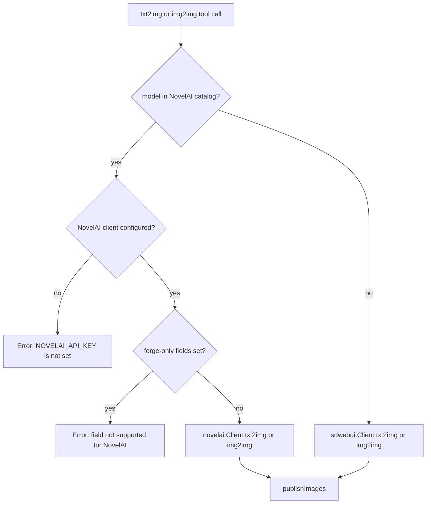

# NovelAI Integration Plan

## Summary

Add NovelAI as a second image-generation backend used by the existing `txt2img` and `img2img` MCP tools. The
`model` argument decides the backend: if it is one of the hardcoded NovelAI model ids, the request is sent to the
NovelAI API and no local Forge checkpoint is loaded; otherwise the request goes to Forge exactly as it does today.

The NovelAI side lives in a new `internal/novelai` package mirroring `internal/sdwebui`. The reference for the
txt2img payload and the model/sampler catalog is `../staircase/libs/imagegen/src/providers/novelai.ts` and
`../staircase/libs/styles-ui/src/editors/NovelAiStyleEditor.tsx`.

## Request Routing



## Design Decisions

1. **Same tools, model-based routing.** No `novelai_txt2img` / `novelai_img2img` tools are added. The catalog
   membership check is the only routing input, so the agent uses the tools exactly as before.
2. **The catalog is hardcoded** and mirrors staircase's `NOVELAI_MODELS` and `NOVELAI_SAMPLERS`. Because local
   checkpoint filenames are unbounded, `model` stays a free-form string and the NovelAI ids are advertised through
   the property's description rather than a JSON Schema `enum`.
3. **Provider-resolved defaults.** `sampler_name` and `scheduler` schema defaults become empty strings; each backend
   substitutes its own default at request-build time (`DPM++ 2M` / `Automatic` for Forge, `k_euler_ancestral` for
   NovelAI). This avoids the injected Forge default leaking into NovelAI requests.
4. **Field mapping.** Generic fields map to NovelAI names (`cfg_scale` to `scale`, `sampler_name` to `sampler`,
   `denoising_strength` to `strength`). Forge-only fields (`forge_preset`, `vae_and_text_models`, `scheduler`,
   `enable_hr`, `hr_*`) are rejected with a clear error when a NovelAI model is selected, rather than silently
   ignored.
5. **Response decoding.** For v4/v5 models the API returns a length-prefixed msgpack stream; the final `image` frame
   is the result. For `nai-diffusion-3` the API returns a ZIP archive. Both are decoded to raw PNG bytes so
   `publishImages` and the S3/shortener behavior are unchanged.
6. **msgpack dependency.** Add `github.com/vmihailenco/msgpack/v5` (v5.4.1) for frame decoding. Hand-rolling a
   decoder would need to skip unknown/extension types correctly, which is error-prone for little gain.

### Parameter mapping

| Tool field | NovelAI parameter |
| --- | --- |
| `model` | top-level `model` |
| `prompt` | top-level `input`, plus `parameters.v4_prompt.caption.base_caption` |
| `negative_prompt` | `parameters.negative_prompt`, plus `parameters.v4_negative_prompt.caption.base_caption` |
| `sampler_name` | `parameters.sampler` |
| `steps` | `parameters.steps` |
| `width`, `height` | `parameters.width`, `parameters.height` |
| `cfg_scale` | `parameters.scale` |
| `seed` | `parameters.seed` (-1 becomes a random uint32) |
| `denoising_strength` (img2img) | `parameters.strength` |
| `noise` (img2img, new field) | `parameters.noise` |

Empty `negative_prompt` falls back to a package-level default negative prompt copied from staircase.

## Package Layout

| Path | Change | Purpose |
| --- | --- | --- |
| `internal/novelai/catalog.go` | New | Hardcoded model and sampler catalog, membership helpers |
| `internal/novelai/client.go` | New | Client, `New`, HTTP plumbing, error formatting |
| `internal/novelai/params.go` | New | Shared parameter builder, seed resolution, dimension normalization |
| `internal/novelai/stream.go` | New | Length-prefixed msgpack frame decoder |
| `internal/novelai/zip.go` | New | ZIP archive decoder for `nai-diffusion-3` |
| `internal/novelai/txt2img.go` | New | `Txt2ImgRequest`, `Txt2Img` |
| `internal/novelai/img2img.go` | New | `Img2ImgRequest`, `Img2Img` |
| `internal/novelai/*_test.go` | New | Unit tests, one file per unit |
| `internal/sdwebui/shared.go` | Edit | Export `ModelExtensions` for reuse |
| `internal/config/config.go` | Edit | `NOVELAI_API_KEY`, `NOVELAI_URL` |
| `internal/server/server.go` | Edit | Build the NovelAI client, pass it to MCP |
| `internal/mcp/server.go` | Edit | Accept the NovelAI client, gate registration |
| `internal/mcp/handlers.go` | New | Dependency-holding handler struct |
| `internal/mcp/provider.go` | New | Per-provider request mappers and validation |
| `internal/mcp/txt2img.go` | Edit | Route by model |
| `internal/mcp/img2img.go` | Edit | Route by model, add `noise` |
| `internal/mcp/bgkill.go` | Edit | Move the handler into `handlers` |
| `internal/mcp/img2txt.go` | Edit | Move the handler into `handlers` |
| `internal/mcp/shared.go` | Edit | Provider-resolved sampler and scheduler defaults |
| `go.mod`, `go.sum` | Edit | Add `github.com/vmihailenco/msgpack/v5` |
| `.env.example`, `README.md` | Edit | Document NovelAI configuration |

## Units

### Unit 1: NovelAI catalog

**Files:** `internal/novelai/catalog.go`, `internal/novelai/catalog_test.go`

**Work:** Define the hardcoded model and sampler catalogs plus membership helpers and defaults.

```go
var Models = []string{
    "nai-diffusion-5-full",
    "nai-diffusion-5-anime",
    "nai-diffusion-5-furry",
    "nai-diffusion-4",
    "nai-diffusion-3",
}

var Samplers = []string{
    "k_euler",
    "k_euler_ancestral",
    "k_dpmpp_2m",
    "k_dpmpp_2s_ancestral",
    "k_dpmpp_sde",
    "ddim",
    "plms",
}

const (
    DefaultModel   = "nai-diffusion-5-full"
    DefaultSampler = "k_euler_ancestral"
)

func IsModel(model string) bool
func IsSampler(sampler string) bool
func UsesZipResponse(model string) bool // true for nai-diffusion-3 only
```

`IsModel` trims whitespace, keeps the id case-sensitive, and strips a known model extension before the lookup so
`nai-diffusion-5-full.safetensors` still routes to NovelAI. Export `sdwebui`'s existing extension list as
`sdwebui.ModelExtensions` and reuse it instead of duplicating the list.

**Acceptance criteria**

- AC-1.1: `Models` equals the five ids above, in that order, matching staircase's `NOVELAI_MODELS`.
- AC-1.2: `Samplers` equals the seven ids above, in that order, matching staircase's `NOVELAI_SAMPLERS`.
- AC-1.3: `IsModel` returns true for every entry in `Models`, for `"nai-diffusion-5-full.safetensors"`, and for
  `" nai-diffusion-4 "`.
- AC-1.4: `IsModel` returns false for `""`, `"sd_xl_base_1.0.safetensors"`, and `"NAI-DIFFUSION-5-FULL"`.
- AC-1.5: `IsSampler` returns true for every entry in `Samplers`, and false for `"DPM++ 2M"` and `""`.
- AC-1.6: `UsesZipResponse("nai-diffusion-3")` is true; it is false for the other four catalog entries.
- AC-1.7: `DefaultModel` and `DefaultSampler` equal the constants above.

### Unit 2: Client and shared parameter builder

**Files:** `internal/novelai/client.go`, `internal/novelai/params.go`, `internal/novelai/client_test.go`,
`internal/novelai/params_test.go`

**Work:** Add the client and the payload fragment shared by txt2img and img2img.

```go
type Client struct {
    baseURL         string
    apiKey          string
    http            *http.Client
    isVerboseErrors bool
    randomSeed      func() uint32 // overridable in tests
}

func New(baseURL, apiKey string, isVerboseErrors bool) *Client
```

`params.go` holds `baseParams(model, prompt, negativePrompt, sampler string, steps, width, height int, scale
float64, seed uint32) map[string]any`. It mirrors the staircase payload: `params_version` 3, `n_samples` 1,
`noise_schedule` `karras`, `image_format` `png`, `ucPreset` 0, `qualityToggle` true, `autoSmea` false,
`dynamic_thresholding` false, `controlnet_strength` 1, `legacy` false, `add_original_image` true, `cfg_rescale` 0,
`legacy_v3_extend` false, `skip_cfg_above_sigma` nil, `use_coords` false, `legacy_uc` false,
`normalize_reference_strength_multiple` true, `inpaintImg2ImgStrength` 1, `deliberate_euler_ancestral_bug` false,
`prefer_brownian` true, `characterPrompts` empty, plus `width`, `height`, `scale`, `steps`, `seed`, `sampler`,
`negative_prompt`, `v4_prompt`, `v4_negative_prompt`. The builder does not include `stream`; txt2img layers
`stream: "msgpack"` on top and img2img leaves it out.

Also in this file:

- `defaultNegativePrompt` const, copied verbatim from staircase's `DEFAULT_NEGATIVE_PROMPT`.
- `resolveSeed(requested int) uint32`: negative seeds become `randomSeed()` in `[0, 4294967295]`, non-negative seeds
  pass through unchanged.
- `normalizeDimensions(width, height int) (int, int, error)`: round each axis up to the nearest multiple of 64, floor
  at 64, and error when total pixels exceed 3047424 or fall below 4096.
- `httpError(method, path string, resp *http.Response) string` mirroring `sdwebui.Client.httpError`.

**Acceptance criteria**

- AC-2.1: `New("https://image.novelai.net/", "sk-x", false)` stores the base URL without the trailing slash and the
  key.
- AC-2.2: The txt2img parameter map has `params_version` 3, `stream` `"msgpack"`,
  `width`/`height`/`steps`/`scale`/`seed` matching the inputs, and `v4_prompt.caption.base_caption` equal to the
  prompt.
- AC-2.3: With an empty negative prompt, `negative_prompt` and `v4_negative_prompt.caption.base_caption` both equal
  `defaultNegativePrompt`; with a supplied negative prompt, both equal it.
- AC-2.4: `resolveSeed(-1)` returns a value in `[0, 4294967295]` (assert against a stubbed `randomSeed` and against the
  real one), and `resolveSeed(42)` returns 42.
- AC-2.5: `normalizeDimensions(833, 1217)` returns `896, 1280`; `normalizeDimensions(32, 32)` errors;
  `normalizeDimensions(4096, 4096)` errors.
- AC-2.6: A non-2xx response produces an error containing the status code, and, when `isVerboseErrors` is set, the
  response body.

### Unit 3: msgpack stream decoder

**Files:** `internal/novelai/stream.go`, `internal/novelai/stream_test.go`

**Work:** Implement `decodeFinalImage(r io.Reader) ([]byte, error)`:

1. Read a 4-byte big-endian frame length.
2. Read exactly that many bytes and msgpack-decode them into a struct with `event_type` and an image value that may be
   `bin` bytes or a base64 `str`.
3. Return the bytes when `event_type == "final"`, otherwise continue.
4. Error with `"novelai stream ended without producing an image"` on clean EOF with no final frame, and a distinct
   error for a truncated frame or an unreasonable length prefix.

**Acceptance criteria**

- AC-3.1: A stream containing one final frame with a `bin` image returns those exact bytes.
- AC-3.2: A stream containing one final frame with a base64 `str` image returns the decoded bytes.
- AC-3.3: Intermediate frames followed by a final frame return the final image.
- AC-3.4: Two concatenated frames each containing a final image return the first final image.
- AC-3.5: A frame with a length prefix larger than the remaining bytes returns an error (not a panic, not a partial
  image).
- AC-3.6: A clean EOF with no frames returns the exact error string above.
- AC-3.7: An all-intermediate stream returns the same error string.

### Unit 4: NovelAI txt2img

**Files:** `internal/novelai/txt2img.go`, `internal/novelai/txt2img_test.go`

**Work:** Add:

```go
type Txt2ImgRequest struct {
    Model          string
    Prompt         string
    NegativePrompt string
    Sampler        string
    Steps          int
    Width          int
    Height         int
    Scale          float64
    Seed           int
}

func (c *Client) Txt2Img(ctx context.Context, req Txt2ImgRequest) ([][]byte, error)
```

For v4/v5 models POST `{base}/ai/generate-image-stream` with
`{"input": prompt, "model": model, "action": "generate", "parameters": {...}}`, the `Authorization: Bearer <key>`
and `Content-Type: application/json` headers, then decode with `decodeFinalImage`. For `nai-diffusion-3` delegate to
the ZIP path from Unit 6.

**Acceptance criteria**

- AC-4.1: The request path is `/ai/generate-image-stream`, the `Authorization` header is `Bearer <key>`, and
  `Content-Type` is `application/json`.
- AC-4.2: The decoded body has `action` `"generate"`, `model` equal to the request model, `input` equal to the prompt,
  and `parameters.stream` equal to `"msgpack"`.
- AC-4.3: A server returning an encoded final frame yields a one-element `[][]byte` containing the frame's image bytes.
- AC-4.4: A `500` response with a body returns an error containing the status and body.
- AC-4.5: Cancelling the request context returns an error rather than hanging.

### Unit 5: NovelAI img2img

**Files:** `internal/novelai/img2img.go`, `internal/novelai/img2img_test.go`

**Work:** Add:

```go
type Img2ImgRequest struct {
    Model          string
    Prompt         string
    NegativePrompt string
    Sampler        string
    Steps          int
    Width          int
    Height         int
    Scale          float64
    Seed           int
    InitImage      []byte
    Strength       float64
    Noise          float64
}

func (c *Client) Img2Img(ctx context.Context, req Img2ImgRequest) ([][]byte, error)
```

For v4/v5 models POST `{base}/ai/generate-image-stream` with `action` `"img2img"` and the shared parameters extended
with `image` (raw standard base64, no `data:` prefix), `strength`, `noise`, and `extra_noise_seed`. Do not set
`parameters.stream` (it only controls intermediate-step streaming). For `nai-diffusion-3` POST
`{base}/ai/generate-image` with `action` `"img2img"`, `sm` and `sm_dyn` forced to false, and the ZIP decoder.

**Acceptance criteria**

- AC-5.1: The path is `/ai/generate-image-stream` and `action` is `"img2img"`.
- AC-5.2: `parameters.image` is the raw base64 of the init image and does not start with `data:`.
- AC-5.3: `parameters.strength` equals the request strength and `parameters.noise` equals the request noise, including
  an explicit `0`.
- AC-5.4: `parameters.extra_noise_seed` is present and within `[0, 4294967295]`.
- AC-5.5: A v4 model payload has no `stream`, `sm`, or `sm_dyn` keys.
- AC-5.6: A `nai-diffusion-3` payload goes to `/ai/generate-image`, contains `sm` and `sm_dyn` both false, and has no
  `v4_prompt` key.
- AC-5.7: A final frame response yields the image bytes.

### Unit 6: v3 ZIP responses

**Files:** `internal/novelai/zip.go`, `internal/novelai/zip_test.go`

**Work:** Add `decodeZipImages(r io.Reader) ([][]byte, error)` using `archive/zip`: read the archive, return the bytes
of every non-directory entry in archive order, and error when the archive has no files or is not a valid ZIP.

**Acceptance criteria**

- AC-6.1: A ZIP with two PNG entries returns two byte slices in archive order, byte-identical to the inputs.
- AC-6.2: A ZIP containing only directory entries returns an error.
- AC-6.3: Non-ZIP bytes return an error.
- AC-6.4: An empty body returns an error.

### Unit 7: Configuration and documentation

**Files:** `internal/config/config.go`, `internal/config/config_test.go`, `.env.example`, `README.md`

**Work:** Add `NovelAIAPIKey string \`env:"NOVELAI_API_KEY"\`` and
`NovelAIURL string \`env:"NOVELAI_URL" envDefault:"https://image.novelai.net"\``. Document both in `.env.example`
under a "NovelAI (optional)" heading that states NovelAI is disabled without a key. Add a short NovelAI section to
the README covering the key, the model list, and that NovelAI models are selected through the `model` argument.

**Acceptance criteria**

- AC-7.1: `Load` with `NOVELAI_URL` unset yields `https://image.novelai.net`; with it set, yields that value.
- AC-7.2: `Load` reads `NOVELAI_API_KEY` into the new field.
- AC-7.3: Both tests restore the environment with `t.Setenv`.
- AC-7.4: `.env.example` lists `NOVELAI_API_KEY` and `NOVELAI_URL`.
- AC-7.5: The README has a NovelAI section of at most a short paragraph plus the model list.

### Unit 8: Server wiring

**Files:** `internal/server/server.go`, `internal/mcp/server.go`, `internal/mcp/server_test.go`

**Work:** Build the NovelAI client in `server.New` when `cfg.NovelAIAPIKey != ""`, log whether it is enabled, and pass
it to `mcp.New`. `mcp.New` and `registerTools` already take the resolver and OpenAI clients, so add
`novelaiClient *novelai.Client` between `sdClient` and `uploader`; the resulting signature is
`New(log, sdClient, novelaiClient, uploader, shortenerClient, resolver, openaiClient)`. Register `txt2img` and `img2img`
when either generation client is present, `bgkill` only when the Forge client is present, and leave `img2txt` gated on
the OpenAI client.

**Acceptance criteria**

- AC-8.1: `server.New` with `NOVELAI_API_KEY` set and an otherwise valid config returns no error.
- AC-8.2: `mcp.New(log, nil, novelaiClient, nil, nil, nil, nil)` registers `txt2img` and `img2img` but not `bgkill`,
  verified by listing tools over an in-memory MCP transport.
- AC-8.3: `mcp.New(log, forgeClient, nil, nil, nil, nil, nil)` still registers `txt2img`, `img2img`, and `bgkill`.
- AC-8.4: `mcp.New(log, nil, nil, nil, nil, nil, nil)` registers no tools and returns no error.
- AC-8.5: `mcp.New(log, nil, nil, nil, nil, nil, openaiClient)` still registers `img2txt` as it does today.

### Unit 9: MCP handler refactor, routing, and schemas

**Files:** `internal/mcp/handlers.go` (new), `internal/mcp/provider.go` (new), `internal/mcp/txt2img.go`,
`internal/mcp/img2img.go`, `internal/mcp/bgkill.go`, `internal/mcp/img2txt.go`, `internal/mcp/shared.go`,
`internal/mcp/shared_test.go`, `internal/mcp/img2txt_test.go`, `internal/mcp/provider_test.go`

**Work:**

1. Introduce `type handlers struct` holding `log`, `forge *sdwebui.Client`, `novelai *novelai.Client`, `uploader`,
   `shortener`, `resolver`, and `openai *openai.Client`, with `txt2img`, `img2img`, `bgkill`, and `img2txt` methods.
   `runImg2Txt` becomes the `img2txt` method so every handler has the same shape, and `register*` functions become thin
   `mcp.AddTool` wrappers around those methods, which keeps the handlers directly unit testable without an MCP
   client.
2. Add request mappers in `provider.go`:
   - `forgeTxt2Img(in)`, `forgeImg2Img(in, data)` (present behavior, substituting `DPM++ 2M` / `Automatic` when the
     sampler or scheduler is empty).
   - `novelaiTxt2Img(in)`, `novelaiImg2Img(in, data)` returning an error for Forge-only fields or a sampler outside
     the catalog.
3. Route in each handler: `novelai.IsModel(in.Model)` selects NovelAI, and a nil NovelAI client becomes an error
   naming `NOVELAI_API_KEY`.
4. Schema changes in `txt2imgSchema` / `img2imgSchema`:
   - Append the catalog to the `model` property description.
   - Set the `sampler_name` and `scheduler` defaults to `""`.
   - Add `noise` to `img2imgInput` (default 0), documented as NovelAI-only.
5. Log lines keep the existing shape and add a `provider` field (`forge` or `novelai`).

**Acceptance criteria**

- AC-9.1: A call with `model` `"nai-diffusion-5-full"` hits only an httptest NovelAI server; a recording Forge httptest
  server receives no request.
- AC-9.2: A call with `model` `"sd_xl_base_1.0.safetensors"` hits only the Forge server.
- AC-9.3: A NovelAI model with no NovelAI client returns an error containing `NOVELAI_API_KEY` and makes no HTTP
  request.
- AC-9.4: A NovelAI model with `enable_hr=true`, or with `forge_preset` set, or with a non-empty `vae_and_text_models`,
  returns an error naming the offending field.
- AC-9.5: A NovelAI model with `sampler_name` `"k_dpmpp_2m"` sends that sampler; with `sampler_name` `""` sends
  `k_euler_ancestral`; with `sampler_name` `"DPM++ 2M"` returns an error listing valid samplers.
- AC-9.6: A Forge model with `sampler_name` `""` sends `DPM++ 2M`, and with `scheduler` `""` sends `Automatic`
  (existing Forge behavior is unchanged).
- AC-9.7: `txt2imgSchema().Properties["model"].Description` contains every id in `novelai.Models`.
- AC-9.8: `img2imgSchema().Properties["noise"]` exists with a default of `0`.
- AC-9.9: `TestSchemasIncludeSharedFields` is extended with `noise` and still passes.
- AC-9.10: The generated images are returned through `publishImages`, so S3 upload, URL shortening, and inline
  `image/png` content behave identically for both backends.
- AC-9.11: `img2txt` is unchanged by the refactor: an httptest image server plus an httptest vision endpoint still
  produce the same text and structured output through the `img2txt` handler method.

## Out of Scope

- Inpainting, vibe transfer, director tools, `enhance`, and upscaling.
- Streaming intermediate steps to the agent; only the final image is returned.
- Per-user NovelAI keys; one `NOVELAI_API_KEY` serves the whole server, matching the Garagefront single-user model.
- Changing Forge behavior beyond the provider-resolved defaults described in Unit 9.

## Validation

Run from the project root:

```sh
go build ./...
go vet ./...
go test ./... -race -count=1
```

`go mod tidy` is required after adding the msgpack dependency in Unit 2.

## Follow-ups

- If staircase later changes `NOVELAI_MODELS` or `NOVELAI_SAMPLERS`, update `internal/novelai/catalog.go` to match.
- Consider exposing `noise_schedule` and `ucPreset` if the agent needs them; they are fixed constants for now.
