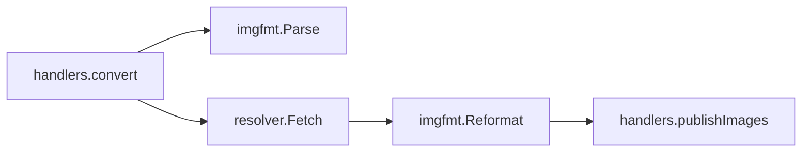

# Convert Tool Plan

Status: Done
Depends on: none

## Goal

Add a `convert` MCP tool that re-encodes an image between png, jpeg, jxl, and webp on request, with no other editing. It
needs no generation backend, so it is available even when Forge and NovelAI are not configured.

```jsonc
// re-encode a stored webp as png
{ "image_url": "https://host/i/x.webp", "format": "png" }

// png in, png out: an error, not a no-op
{ "image_url": "https://host/i/x.png", "format": "png" }
```

## Motivation

Format conversion exists today only as a side effect of another operation: every image tool ends in `publishImages`,
which calls `imgfmt.Convert` to re-encode the result in the requested `format`. `imgfmt.Convert` deliberately returns its
input untouched when the source format already matches the target, which is right for those tools and useless as a
conversion tool: a caller who wants a jxl copy of an image can only get one by running a generation, a `bgkill`, a
`crop`, or a `bg` over it.

Because it is a no-op, `Convert` also cannot answer "is this already a png?" for a caller. A tool that is asked to
convert an image to the format it already has should say so instead of handing back the same bytes, which is what
`imgfmt.Reformat` provides.

## Scope

In scope:

- A `convert` tool: `image_url` and a required `format`, and nothing else.
- `imgfmt.Reformat`, the strict counterpart of `Convert`, which errors when the input is already in the target format.
- Registering the tool unconditionally, alongside `crop` and `bg`, independent of Forge and NovelAI.

Out of scope:

- Changing `Convert`'s passthrough behaviour. `publishImages` depends on it, so the strictness lives in the new function.
- Quality, lossless, effort, or metadata knobs. `convert` uses the same `encodeQuality` every other tool uses.
- Resizing, cropping, background removal, or any other pixel change. `convert` re-encodes and nothing else.
- Reworking the other tools to use `Reformat`. They want the passthrough, not the error.
- Base64 and data-URI inputs. Like `crop` and `bg`, the tool takes a URL and uses `Resolver.Fetch`.

## Design

### Why `format` is required and has no default

Every other tool defaults `format` to `OUTPUT_FORMAT` (webp out of the box), which would make the common case of a webp
input a hard failure for a caller who did not name a format at all. `convert` therefore requires `format`: the tool's
only job is to produce a named format, so there is no sensible default, and the "already in this format" error is always
a consequence of something the caller asked for.

### Package changes

`internal/imgfmt` gains `Reformat(data []byte, format Format) ([]byte, error)` in `convert.go`. It reads the source
format with `image.DecodeConfig`, the same way `Convert` does, returns an error naming the format when the source already
matches, and otherwise delegates to `Convert`. `Convert` itself is unchanged, so `publishImages` keeps its passthrough.

`internal/mcp` gains `convert.go` with the input struct, handler, and schema, following `bg.go`. `handlers.convert`
parses the format with `imgfmt.Parse` (not `h.outputFormat`, since there is no default), fetches the URL, calls
`imgfmt.Reformat`, and hands the bytes to `publishImages`, which re-encodes nothing because the bytes are already in the
target format.

`internal/mcp/shared.go` splits `setFormatSchema` into the default-setting half and `setFormatEnum`, which
`setFormatSchema` still calls; `convert` uses `setFormatEnum` alone.

### Flow



`Reformat` errors before any decoding when the source format matches the target, so a same-format call does no work
beyond the header read.

## Implementation units

### Unit 1: strict conversion in `imgfmt`

Deliverables: `internal/imgfmt/convert.go`, `internal/imgfmt/convert_test.go`.

Acceptance criteria:

- [x] `Reformat` returns output in the requested format for every source and target pair that differ, and the decoded
      output is the requested format.
- [x] `Reformat` returns an error for every source/target pair that match, naming the format, and it does not return the
      input.
- [x] `Reformat` keeps alpha for png, jxl, and webp, and flattens onto white for jpeg.
- [x] `Reformat` errors with an `imgfmt:` prefix for non-image data and for an unknown target format.
- [x] `Convert` is unchanged, including its passthrough for a matching format.

### Unit 2: the `convert` tool

Deliverables: `internal/mcp/convert.go`, `internal/mcp/convert_test.go`, `internal/mcp/server.go`,
`internal/mcp/server_test.go`, `internal/mcp/shared.go`, `internal/mcp/annotations_test.go`.

Acceptance criteria:

- [x] A `convert` call with `image_url` and `format` returns a URL text block and an image block, in the user's and the
      assistant's audience, in the requested format, the way the other image tools do.
- [x] A `convert` call whose `format` matches the input's format returns an error prefixed `convert:` that names the
      format, and stores nothing.
- [x] The tool is registered with no Forge and no NovelAI configured, and `TestToolRegistration` expects `convert` in
      every case.
- [x] The schema marks both `image_url` and `format` required, has no `format` default, and sets the `format` enum.
- [x] The tool carries the image-generation annotations (`readOnly=false`, `destructive=false`, `idempotent=false`,
      `openWorld=true`), and `TestToolAnnotations` covers it.
- [x] A fetch failure and an invalid `format` both return an error prefixed `convert:`.
- [x] `setFormatEnum` on its own sets no default, and `setFormatSchema` still sets both, so `crop`, `bg`, `bgkill`,
      `txt2img`, and `img2img` schemas are unchanged.

### Unit 3: documentation

Deliverables: `README.md`, `docs/PROMPT.md`.

Acceptance criteria:

- [x] `README.md` describes `convert` as backend-free conversion between the four formats, and states that asking for
      the format the image already has is an error.
- [x] `docs/PROMPT.md` tells the agent it can call `convert` to change an image's file type.

## Verification

Per unit, `go build ./...`, `go vet ./...`, and `go test ./... -race -count=1`, as CI runs them.

Human check, marked because it needs a deployment: call `convert` on a stored webp URL from a previous call with
`format: "png"`, confirm the returned file is a png; then call it again with `format: "webp"` on the same URL and confirm
it returns an error rather than an image.
