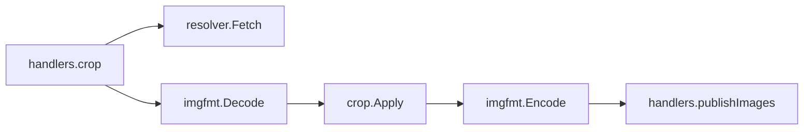

# Crop Tool Plan

Status: Done
Depends on: none

## Goal

Add a `crop` MCP tool that trims an image to the bounding box of its visible content and can then pad it, centre it on a
transparent square, or cut it into a circle. It needs no generation backend, so it is available even when Forge and
NovelAI are not configured.

```jsonc
// crop an uploaded logo, then put it on a padded transparent square
{ "image_url": "https://host/i/logo.png", "square": true, "padding": 64 }

// make a circular avatar (circle implies square)
{ "image_url": "https://host/i/avatar.webp", "circle": true }
```

## Motivation

`bgkill` does two unrelated things: it removes a background with BiRefNet, and then it crops, pads, or circularises the
result. The geometry half is pure standard-library work with no GPU, no model, and no Forge, but it is only reachable
through `bgkill`, which `registerTools` registers only when Forge is configured. An operator without Forge therefore
cannot crop, pad, or circularise an image at all today, and a caller who has Forge has to run a model to get geometry.

## Scope

In scope:

- A `crop` tool: `image_url`, optional `square`, `circle`, and `padding`, plus the shared `format`.
- The tool always trims to the visible content bounding box; `square` and `circle` are refinements, matching `bgkill`.
- Extracting the pure geometry from `internal/crop` so it works on any decoded image, not only a PNG.
- A public decode/encode boundary in `internal/imgfmt`, which already registers the jxl and webp codecs.
- Registering the tool unconditionally, alongside `anlas`, independent of Forge and NovelAI.

Out of scope:

- Changing `bgkill`'s inputs, outputs, or behaviour. Its `crop`/`square`/`circle`/`padding` knobs stay as they are.
- Removing `bgkill`'s crop code path. Both tools call `internal/crop`.
- Resizing, rotating, or arbitrary rectangular region cropping.
- Base64 and data-URI inputs. Like `bgkill`, the tool takes a URL and uses `Resolver.Fetch`; `Resolver.Resolve` is
  unchanged.

## Design

### What the tool crops

`crop` keys off the alpha channel, the same way `bgkill` does. The content box is the bounding box of every pixel whose
alpha exceeds the threshold (zero by default, so any visible pixel counts). For a fully opaque image that box is the
whole frame, so trimming is a no-op while `square`, `circle`, and `padding` still apply. An image with no visible pixel
at all is an error, as in `bgkill`.

### Package changes

`internal/crop` gains `Apply(src image.Image, opts Options) (*image.RGBA, error)`, the extraction of today's
`contentBounds` plus `render`, and keeps `ToContent(pngData []byte, opts Options) ([]byte, error)` for `bgkill`,
reimplemented as decode PNG, `Apply`, encode PNG. `Options`, `Request`, and `OptionsFor` do not change.

`internal/imgfmt` gains `Decode(data []byte) (image.Image, error)` and `Encode(img image.Image, format Format)
([]byte, error)`, the public forms of decoding and encoding that `Convert` and `Inline` already do internally. They stay
a thin wrapper over `image.Decode` and the existing private `encode`, so behaviour (JPEG flattened onto white, WebP and
PNG keeping alpha) is identical to `Convert`.

`internal/mcp` gains `crop.go` with the input struct, handler, request mapping, and schema, following `bgkill.go`.
`registerTools` registers it unconditionally.

### Naming

The `square`, `circle`, and `padding` inputs keep `bgkill`'s names and semantics, so the two tools read the same.
There is no `crop` boolean: a tool named `crop` crops, so the trim is always applied and only the refinements are
optional. `padding` keeps `crop.OptionsFor`'s defaults: 32 pixels for a square, none for a circle or a bare trim.

### Flow



`Encode` writes the requested format, and `publishImages`'s `imgfmt.Convert` then returns those bytes untouched because
the source format already matches the target.

## Implementation units

### Unit 1: geometry in `crop`, codecs in `imgfmt`

Deliverables: `internal/crop/crop.go`, `internal/crop/crop_test.go`, `internal/imgfmt/codec.go`,
`internal/imgfmt/codec_test.go`.

Acceptance criteria:

- [x] `crop.Apply` trims to the content bounding box and applies padding, square, and circle, with the same results the
      existing `ToContent` tests assert; the existing tests still pass, so `ToContent` is unchanged in behaviour.
- [x] `crop.Apply` returns an error for negative padding and for an image with no visible content.
- [x] `crop.ToContent` still decodes only PNG and returns PNG, and `bgkill` compiles and behaves as before.
- [x] `imgfmt.Decode` decodes each of png, jpeg, webp, and jxl, and errors with an `imgfmt:` prefix for non-image data.
- [x] `imgfmt.Encode` round-trips each format, keeping alpha for png, webp, and jxl, and flattening onto white for jpeg.

### Unit 2: the `crop` tool

Deliverables: `internal/mcp/crop.go`, `internal/mcp/crop_test.go`, `internal/mcp/server.go`,
`internal/mcp/server_test.go`, `internal/mcp/annotations_test.go`.

Acceptance criteria:

- [x] A `crop` call with `image_url` returns a URL text block and an image block, in the user's and the assistant's
      audience, in the requested `format`, the way the other image tools do.
- [x] The output is trimmed to the content bounding box, proven with an image that has transparent margins.
- [x] `circle` cuts the corners transparent and `square` produces a square canvas; `padding` adds transparent border.
- [x] The tool is registered with no Forge and no NovelAI configured, and `TestToolRegistration` expects `crop` in every
      case.
- [x] The tool carries the image-generation annotations (`readOnly=false`, `destructive=false`, `idempotent=false`,
      `openWorld=true`), and `TestToolAnnotations` covers it.
- [x] The schema marks `image_url` required, defaults `square` and `circle` to false, has no default for `padding`, and
      sets the `format` enum and default.
- [x] A fetch failure and an undecodable image both return an error prefixed `crop:`.

### Unit 3: documentation

Deliverables: `README.md`, `docs/PROMPT.md`, `AGENTS.md`.

Acceptance criteria:

- [x] `README.md` describes `crop` as backend-free trimming with optional square, circle, and padding.
- [x] `docs/PROMPT.md` tells the agent it can chain a `crop` call to trim or circularise an image it already has.
- [x] `AGENTS.md`'s diagram gains the `internal/mcp` to `internal/crop` arrow.

## Verification

Per unit, `go build ./...`, `go vet ./...`, and `go test ./... -race -count=1`, as CI runs them.

Human check, marked because it needs a deployment: call `crop` on a stored image URL from a previous call with
`circle: true` and confirm the returned avatar has transparent corners and no Forge instance is required.
