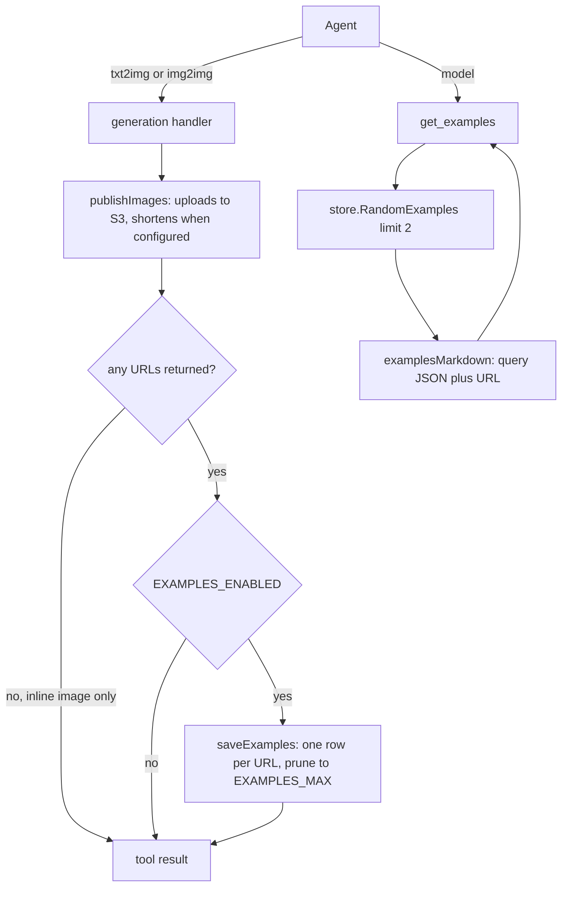

# Examples Implementation Plan

## Goal

Add a `get_examples` MCP tool that returns two random previously generated examples for a model. When the feature is
enabled, every successful `txt2img` and `img2img` generation stores the query that produced it (as JSON) together with
the URL of the resulting image, keyed by model, and each model retains only its newest `EXAMPLES_MAX` examples (default
16), on the assumption that newer generations are better.

Examples are only ever stored when the generation produced a URL, which in practice means S3 upload is configured. The
database therefore holds prompts, settings, and links; it never holds image bytes.

## Prerequisite

This plan reuses the store created by [`REVIEWS_PLAN.md`](REVIEWS_PLAN.md): its Unit 1 (`internal/store` client, schema,
and `DB_PATH`), its Unit 3 (`mcp.Deps`), and its Unit 5 documentation conventions. Land that plan first, or lift its Unit
1 verbatim if examples are implemented alone.

## Scope

In scope:

- The `examples` table in the existing store package, with insert, retention, and random retrieval.
- Capture from the `txt2img` and `img2img` handlers, gated by `EXAMPLES_ENABLED` and by the generation having returned a
  URL.
- `EXAMPLES_MAX` (per model) with a default of 16.
- The `get_examples` tool, Markdown rendering, docs, and tests.

Out of scope:

- Examples without S3: no uploader means no URL, which means nothing is stored.
- Storing image bytes, or re-uploading anything when examples are read.
- Examples for `bgkill`, `img2txt`, or `anlas`; only image generation produces an example.
- Deleting or editing an example, or fetching one by id.
- Cross-model retrieval, search, ranking, or pagination; retrieval is random within one model.
- Resolving or refreshing stored URLs; they are kept exactly as they were returned.

## Design

### Capture requires a URL

`publishImages` returns URLs only when the S3 uploader is configured, and those are the URLs the agent receives (with
the shortener applied when it is set up). Capture happens after `publishImages` and stores only the query it was called
with plus those URLs, so "examples need S3" is a consequence of the design rather than a separate check: with no uploader
there is no URL to store, and the feature is inert.

The README documents this as an expected limitation rather than a defect: an operator who enables examples without
configuring `S3_*` gets a warning at startup and no examples, and `get_examples` is not registered, so an agent is never
offered a tool that cannot return anything.



### Schema

Added to the same `schema` const in `internal/store/store.go`, so opening the database stays idempotent:

```sql
CREATE TABLE IF NOT EXISTS examples (
    id         INTEGER PRIMARY KEY AUTOINCREMENT,
    model      TEXT NOT NULL,
    tool       TEXT NOT NULL,
    query      TEXT NOT NULL,
    url        TEXT NOT NULL,
    created_at TEXT NOT NULL
);

CREATE INDEX IF NOT EXISTS examples_model_id_idx ON examples (model, id);
```

### Stored query

`query` is the tool's input struct marshalled as JSON, unmodified: for `txt2img` it carries `model`, `prompt`,
`negative_prompt`, `sampler_name`, `scheduler`, `steps`, `width`, `height`, `cfg_scale`, `seed`, the hi-res fields, and
`forge_preset`/`vae_and_text_models` when set; for `img2img` it additionally carries `init_image_url`,
`denoising_strength`, and `noise`.

One JSON column is deliberately used instead of typed columns. The set of settings is the tool schema's, which grows,
and a blob captures every field at the time of the call without a schema migration each time a knob is added. Empty
fields are omitted by the existing `omitempty` tags, which reads the same way as a repeated call with those fields left
out.

### Package layout

| Path                                                 | Change | Purpose                                                   |
| ---------------------------------------------------- | ------ | --------------------------------------------------------- |
| `internal/store/example.go`                          | New    | `Example`, `ExampleMeta`, `SaveExample`, `RandomExamples` |
| `internal/store/example_test.go`                     | New    | Persistence, retention, and random retrieval tests        |
| `internal/store/store.go`                            | Edit   | Add the `examples` table to the schema                    |
| `internal/config/config.go`                          | Edit   | `EXAMPLES_ENABLED`, `EXAMPLES_MAX`                        |
| `internal/config/config_test.go`                     | Edit   | Tests for both variables                                  |
| `internal/mcp/examples.go`                           | New    | `ExamplesConfig`, `saveExamples`, `get_examples`, schema  |
| `internal/mcp/example_markdown.go`                   | New    | `examplesMarkdown`                                        |
| `internal/mcp/examples_test.go`                      | New    | Capture, registration, handler, and Markdown tests        |
| `internal/mcp/server.go`                             | Edit   | `Deps.Examples`, register `get_examples` when usable      |
| `internal/mcp/handlers.go`                           | Edit   | Hold the examples config                                  |
| `internal/mcp/txt2img.go`, `internal/mcp/img2img.go` | Edit   | Save a captured example after publishing                  |
| `internal/server/server.go`                          | Edit   | Validate, warn when S3 is missing, pass the config        |
| `internal/server/server_test.go`                     | Edit   | Enabled, disabled, and invalid-value cases                |
| `.env.example`, `README.md`, `docs/PROMPT.md`        | Edit   | Document the feature and its S3 requirement               |

### Configuration

| Env var            | Required | Default | Purpose                                                  |
| ------------------ | -------- | ------- | -------------------------------------------------------- |
| `EXAMPLES_ENABLED` | No       | `false` | Captures examples and registers `get_examples` when true |
| `EXAMPLES_MAX`     | No       | `16`    | Maximum number of examples retained per model            |

`EXAMPLES_MAX` must be at least 1 when examples are enabled; otherwise startup fails with an error naming the variable.
The value is ignored when the feature is disabled.

### Design decisions

1. **An example is a query plus the URL it produced.** Image bytes are not stored: the object store already holds the
   image, and a row that points at it stays small, keeps the database independent of the image lifecycle, and needs no
   re-upload when an example is read back.
2. **A URL is required, so S3 is required.** Capture writes only the URLs `publishImages` returned, which exist only
   when an uploader is configured. No separate S3 check exists, and nothing is captured for an inline-only response.
3. **`get_examples` is registered only when examples are enabled, a store exists, and an uploader is configured.**
   Otherwise the tool could never return data, and an operator who misconfigures the feature is told by a startup
   warning rather than by a permanently empty tool.
4. **The whole query is one JSON column.** Settings change with the tool schema; a blob records exactly what was called
   with and needs no migration per new knob.
5. **The query is stored as the agent sent it.** No provider mapping is applied, so an omitted `sampler_name` means the
   backend default, exactly as it would for a repeated call.
6. **Retention is per model, by insertion order.** The newest `EXAMPLES_MAX` rows by id survive; the rest of the database
   is untouched. Ordering by `id` rather than a timestamp keeps retention independent of the clock.
7. **Capture is best-effort.** Generation already succeeded and the agent already has the URL, so a database problem must
   not turn a successful call into an error.
8. **Only `txt2img` and `img2img` capture.** `bgkill` and `img2txt` are transformations of an existing image rather than
   generations from a model, and `anlas` produces nothing.
9. **Two examples, and only a model as input.** The count is a package constant rather than an input, so the schema stays
   small and results stay predictable.
10. **Fewer than two saved examples is not an error.** The tool returns what exists, including none, and says so; an
    empty table is a normal state during early use.
11. **The stored URL is exactly the one returned to the agent**, including shortening. It is therefore immediately
    reusable, and it can stop resolving when the shortener is configured with an expiry; see Follow-ups.
12. **Model matching is exact.** Examples are keyed by the model string as passed, with no trimming or case folding, so
    the same checkpoint written two ways is two sets of examples. Normalising would silently merge them, and generation
    routing uses the string verbatim anyway.

## Non-functional Requirements

Security:

- Every query uses bound parameters; the model string is never interpolated into SQL.
- The stored query repeats the prompt and settings the agent already sent, and the stored URL is one the agent already
  received, so the database does not widen data exposure beyond the deployment.
- No image bytes are stored, so the database is not a second copy of the object store and does not need the disk or the
  backup footprint of one.
- The database grows only up to `EXAMPLES_MAX` rows per model, so a long-running deployment cannot fill its disk from
  examples alone.

Performance:

- The insert and the prune run in one transaction, so the row count never exceeds the cap and no reader sees an over-cap
  model.
- The prune is a single statement limited by the cap, and the `(model, id)` index serves both it and the random
  selection.
- Rows are small text, so capture is one short write on a request that already spent seconds in image generation and a
  network upload.
- `ORDER BY RANDOM() LIMIT 2` over at most 16 rows per model is negligible.

Maintainability:

- Adding a setting to the generation tools requires no change in the store, because the query is opaque JSON.
- Capture is one call at the end of the two generation handlers, so no generation logic changes.
- Markdown rendering is a pure function tested with hand-built rows.
- The store knows nothing about MCP, tool schemas, backends, or S3.

## Units

### Unit 1: Example persistence and configuration

Files:

- `internal/store/example.go` (new)
- `internal/store/example_test.go` (new)
- `internal/store/store.go` (edit)
- `internal/config/config.go` (edit), `internal/config/config_test.go` (edit)

API:

```go
type ExampleMeta struct {
    Model string
    Tool  string
    Query string
    URL   string
}

type Example struct {
    ID int64
    ExampleMeta
    CreatedAt time.Time
}

func (c *Client) SaveExample(ctx context.Context, meta ExampleMeta, retainPerModel int) (int64, error)
func (c *Client) RandomExamples(ctx context.Context, model string, count int) ([]Example, error)
```

Behaviour:

1. `SaveExample` trims the model, tool, and URL, requires all four fields non-empty, requires `Query` to be valid JSON,
   and requires `retainPerModel` of at least 1. It then inserts the row with `created_at` as RFC3339Nano UTC, deletes
   rows for the same model that fall outside the newest `retainPerModel` by id, and commits, all in one transaction.
2. The prune is
   `DELETE FROM examples WHERE model = ? AND id NOT IN (SELECT id FROM examples WHERE model = ? ORDER BY id DESC LIMIT ?)`.
3. `RandomExamples` validates the model and count, then selects the stored columns for that model ordered by `RANDOM()`
   limited to `count`. The returned order is the random order, which the caller relies on for rendering.
4. Errors are prefixed `store:`.

Acceptance criteria:

- [x] AC-1.1: `SaveExample` returns a positive id, and `RandomExamples(ctx, model, 1)` returns a row whose model, tool,
      query, and URL are identical to what was passed.
- [x] AC-1.2: Saving 17 examples for one model with a retain value of 16 leaves the 16 newest ids; the first saved row is
      gone and the other 16 remain.
- [x] AC-1.3: Pruning affects only the saved model; saving for model `B` never removes rows for model `A`.
- [x] AC-1.4: After each of 20 sequential saves for one model with a retain value of 5, the model's row count is at most 5.
- [x] AC-1.5: `SaveExample` rejects an empty or whitespace-only model, an empty tool, an empty query, an empty URL, and a
      retain value of 0 or less, and writes nothing in each case.
- [x] AC-1.6: `SaveExample` rejects a query that is not valid JSON, such as `not json` and an empty JSON value, and writes
      nothing.
- [x] AC-1.7: The URL is stored verbatim, including a query string, a fragment, and percent-encoded characters; a 2000
      character URL round-trips unchanged.
- [x] AC-1.8: The stored query round-trips byte-for-byte, including embedded newlines, tabs, quotes, and Markdown
      metacharacters, and is not reordered or reformatted.
- [x] AC-1.9: `RandomExamples(ctx, model, 2)` returns at most two rows, only for the requested model, with no duplicate ids;
      across 50 calls on 16 saved rows it returns at least two distinct result sets.
- [x] AC-1.10: With one saved row, `RandomExamples(ctx, model, 2)` returns that one row; with none it returns an empty,
      non-nil slice and no error.
- [x] AC-1.11: `RandomExamples` rejects an empty model and a count below 1.
- [x] AC-1.12: Eight goroutines saving alternately for two models all succeed, and neither model exceeds its retain value,
      when the test runs with `-race`.
- [x] AC-1.13: `Load()` reads `EXAMPLES_ENABLED` and `EXAMPLES_MAX`; the defaults are `false` and `16`.
- [x] AC-1.14: Opening a database created by an earlier version of the store (without the `examples` table) adds the table
      without touching existing `reviews` rows, proving the schema stays idempotent.
- [x] AC-1.15: Tests use `t.TempDir()` and close the client in `t.Cleanup`.

### Unit 2: Capture examples from generations

Files:

- `internal/mcp/examples.go` (new)
- `internal/mcp/examples_test.go` (new)
- `internal/mcp/handlers.go` (edit), `internal/mcp/server.go` (edit)
- `internal/mcp/txt2img.go` (edit), `internal/mcp/img2img.go` (edit)
- `internal/server/server.go` (edit), `internal/server/server_test.go` (edit)

API:

```go
type ExamplesConfig struct {
    Enabled bool
    Max     int
}

func (h *handlers) saveExamples(ctx context.Context, tool, model string, query any, urls []string)
```

Behaviour:

1. `Deps` gains `Examples ExamplesConfig` and `handlers` gains `examples ExamplesConfig`. `server.New` populates it from
   config, returns an error naming `EXAMPLES_MAX` when the feature is enabled with a value below 1, and logs a warning
   stating that no examples will be saved when examples are enabled but the S3 uploader could not be built.
2. `saveExamples` returns immediately unless examples are enabled, the store is non-nil, and there is at least one URL.
   It marshals `query` to JSON, logs a warning and returns on a marshal error, then saves one row per URL with
   `ExampleMeta{Model, Tool, Query, URL}` and `h.examples.Max` as the retain value.
3. A save error is logged at warn level naming the tool and model; `saveExamples` never returns an error and never
   affects the tool result.
4. `txt2img` and `img2img` call `saveExamples` with the tool name, `in.Model`, the input struct itself as `query`, and
   `out.URLs` from `publishImages`, before returning the result.

Acceptance criteria:

- [x] AC-2.1: With examples enabled and an uploader configured (a test uploader built with `s3upload.New` against an
      httptest endpoint and a `PublicBaseURL`, so returned URLs are `https://cdn.example.com/i/mcp/<id>.png`), a `txt2img`
      call through `CallTool` against the existing Forge test backend stores exactly one row.
- [x] AC-2.2: The stored row's `model` and `tool` match the call, its `url` equals the URL in the tool's structured output,
      and its `query` unmarshals to a map containing the prompt, negative prompt, sampler, scheduler, steps, width, height,
      cfg scale, and seed from the request.
- [x] AC-2.3: The same for `img2img`, whose stored query additionally contains `init_image_url`, `denoising_strength`, and
      `noise`, and whose `tool` is `img2img`.
- [x] AC-2.4: With examples enabled but no uploader, the call still succeeds, returns inline image content, and writes no
      row, because no URL is produced.
- [x] AC-2.5: With examples disabled and an uploader configured, no row is written.
- [x] AC-2.6: The model column holds the model exactly as passed, for both a Forge checkpoint filename and a NovelAI model
      id.
- [x] AC-2.7: An empty `sampler_name` and `scheduler` are absent from the stored query rather than being filled with a
      provider default.
- [x] AC-2.8: A generation failure writes no row; a failed S3 upload writes no row, because the tool returns an error before
      capture.
- [x] AC-2.9: A capture failure (a closed store) does not fail the call: the tool still returns the image URL, and a warning
      naming the tool is logged.
- [x] AC-2.10: No log entry contains the marshalled query, the prompt, or the URL; the warning carries the model, tool, and
      error at most.
- [x] AC-2.11: `server.New` errors when `EXAMPLES_ENABLED` is true and `EXAMPLES_MAX` is 0 or negative, naming
      `EXAMPLES_MAX`, and succeeds when `EXAMPLES_MAX` is 1.
- [x] AC-2.12: `server.New` logs a warning naming examples when `EXAMPLES_ENABLED` is true and no `S3_*` configuration is
      provided, and logs none when an uploader is built; in both cases startup succeeds.
- [x] AC-2.13: `saveExamples` called with an already-cancelled context logs a warning and returns without panicking or
      writing a row.

### Unit 3: `get_examples` tool

Files:

- `internal/mcp/examples.go` (edit)
- `internal/mcp/example_markdown.go` (new)
- `internal/mcp/examples_test.go` (edit)
- `internal/mcp/server.go` (edit)

API:

```go
const examplesPerCall = 2

type getExamplesInput struct {
    Model string `json:"model" jsonschema:"model to fetch saved examples for: a Forge checkpoint filename or a NovelAI model id"`
}

type getExamplesOutput struct {
    Model string `json:"model" jsonschema:"the model the examples are for"`
    Count int    `json:"count" jsonschema:"number of examples returned"`
}

func examplesMarkdown(model string, examples []store.Example) string
```

Behaviour:

1. `registerTools` registers `get_examples` when `h.examples.Enabled && h.store != nil && h.uploader != nil`.
2. The handler calls `RandomExamples(ctx, in.Model, examplesPerCall)` and returns a single `TextContent` with
   `examplesMarkdown`, plus structured output naming the model and the number returned. No image content is returned;
   the URL in the Markdown is what the caller passes to another tool or renders.
3. With no examples, the text is `No examples saved for <model> yet.`, `count` is 0, and the call succeeds.
4. The Markdown renders the stored query inside a fenced `json` block, pretty-printed with `json.Indent`. A query that
   does not parse (only possible if a row was edited outside the service) is rendered raw.
5. Markdown format:

````markdown
# Examples for nai-diffusion-5-full

## Example 1 (txt2img)

```json
{
    "model": "nai-diffusion-5-full",
    "prompt": "a cat sitting on a fence",
    "steps": 28,
    "width": 832,
    "height": 1216,
    "cfg_scale": 5,
    "seed": 12345
}
```

- Saved: 2026-09-17T12:00:00Z
- Image: https://cdn.example.com/i/mcp/abc.png

## Example 2 (img2img)

```json
{
    "model": "nai-diffusion-5-full",
    "prompt": "a dog on a beach",
    "init_image_url": "https://example.com/dog.png",
    "denoising_strength": 0.75
}
```

- Saved: 2026-09-17T12:05:00Z
- Image: https://cdn.example.com/i/mcp/def.png
````

Acceptance criteria:

- [x] AC-3.1: `get_examples` is registered only when `ExamplesConfig.Enabled` is true, the store is non-nil, and the
      uploader is non-nil; it is absent when any of the three is missing, asserted by listing tools over an in-memory
      session.
- [x] AC-3.2: The tool requires `model` with no default and has no other input properties.
- [x] AC-3.3: The result is a single `TextContent`; no `ImageContent` is returned even when examples exist.
- [x] AC-3.4: Structured output reports the requested model and the exact number of examples returned.
- [x] AC-3.5: With no saved examples, the call succeeds with the text `No examples saved for <model> yet.` and `count` 0.
- [x] AC-3.6: With one saved example, one section is rendered; with at least two, exactly two are rendered and each carries
      its own URL.
- [x] AC-3.7: The URLs in the Markdown are byte-identical to the URLs stored by capture, verified end to end through
      `CallTool`.
- [x] AC-3.8: A store error (a closed client) becomes a tool error prefixed `get_examples:` rather than a panic.
- [x] AC-3.9: The Markdown matches the format above for a `txt2img` row and an `img2img` row, including the fenced JSON
      block, the `Saved` and `Image` bullets, and the blank lines between blocks.
- [x] AC-3.10: `examplesMarkdown` is a pure function tested directly with hand-built rows covering an empty slice, a query
      with multi-byte text, a query whose values contain Markdown metacharacters and newlines, and a query that is not valid
      JSON.
- [x] AC-3.11: Only the requested model's rows are used, and no more than two are returned even when more exist.

### Unit 4: Documentation

Files:

- `README.md` (edit)
- `.env.example` (edit)
- `docs/PROMPT.md` (edit)

Acceptance criteria:

- [x] AC-4.1: The README features list gains one bullet stating that, when `EXAMPLES_ENABLED` is set, every generation is
      saved per model (the query and the resulting URL) and `get_examples` returns two random ones, and that only the newest
      `EXAMPLES_MAX` are kept.
- [x] AC-4.2: The README bullet, or a line directly under it, states plainly that the feature only works when images are
      uploaded, so `S3_*` must be configured, and that without it nothing is saved and the tool is not registered. It is
      described as an expected limitation of the feature rather than a bug.
- [x] AC-4.3: `.env.example` lists `EXAMPLES_ENABLED` and `EXAMPLES_MAX` under an `examples (optional)` heading, stating the
      defaults, that the cap is per model, that the oldest are dropped first, and that the feature requires `S3_*`.
- [x] AC-4.4: `docs/PROMPT.md` gains a short bullet telling the agent to call `get_examples` for a model it has not used
      before.
- [x] AC-4.5: The README stays high level and defers the detail to `.env.example`, matching the existing style.

## Out of Scope

- Any storage of image bytes, including a thumbnail.
- Capturing generations that returned inline images, such as when S3 is not configured.
- Ranking or weighting examples by review score.
- Deleting, editing, exporting, or listing examples beyond the random pair.
- Refreshing or re-presigning a stored URL that has stopped resolving.
- Examples for images the agent never received, such as a generation whose upload failed.
- Per-caller example isolation.

## Validation

Run from the project root:

```sh
go build ./...
go vet ./...
go test ./... -race -count=1 -coverprofile=coverage.out
go tool cover -func=coverage.out
```

Every test must be hermetic: databases live under `t.TempDir()`, backends and the S3 endpoint are `httptest` servers,
tool registration is exercised over an in-memory MCP transport, and no test writes inside the repository.

## Human Verification

- HV-1: Start the server with `EXAMPLES_ENABLED=true` and `S3_*` configured, generate a few images for one model, then
  call `get_examples` and confirm two examples come back, that each URL resolves to the image that was generated, and
  that the JSON shows the settings you called with.
- HV-2: Generate more than `EXAMPLES_MAX` images for one model and confirm the oldest are dropped and that examples for
  another model are untouched, using `EXAMPLES_MAX=3` to keep it quick.
- HV-3: Restart the server and confirm examples persist, and that they survive replacing the container when a volume is
  mounted at `/data`.
- HV-4: Start the server with `EXAMPLES_ENABLED=true` but no `S3_*` and confirm it starts with a warning, that
  generations still work, and that the tool list has no `get_examples`.
- HV-5: Read the Markdown `get_examples` returns in a real client and confirm the fenced JSON and the URL are legible,
  and that a URL can be passed straight to `img2img`.
- HV-6: `.env.example` is unreadable for agents under editor privacy settings. The `EXAMPLES_ENABLED` and
  `EXAMPLES_MAX` entries were appended without reading the file; confirm their placement and formatting.

## Follow-ups

- Store the unshortened upload URL alongside the returned one so a shortener expiry cannot rot an example; this needs
  `publishImages` to surface the pre-shortening URL.
- Store the object key and re-presign on read, so an example whose presigned URL has expired (7 days) can be refreshed
  instead of pointing at nothing.
- Weight or rank examples using `reviews` once a model has enough reviews to be meaningful.
- Add an examples count or list tool if an operator needs to inspect the table.
