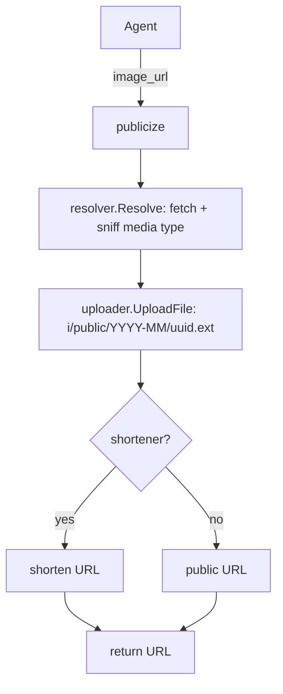

# Publicize Tool Plan

## Goal

Add a `publicize` MCP tool that takes an image URL, downloads it, and stores it in Garagefront's world-readable
`/i/public/...` namespace, returning the public URL. Unlike the `public` flag on the generating tools, this is for an
image the server did not create, so the stored object must keep the source image's media type.

## Scope

In scope:

- A `publicize` tool with an `image_url` input, gated on S3 upload being configured.
- Media-type aware uploads in `s3upload`, so a JPEG or WebP source is not stored as a PNG.
- Reuse of the resolver so shortener and Garagefront input URLs resolve like every other tool.
- README and agent prompt docs, plus tests.

Out of scope:

- Re-encoding or transforming the image; bytes are stored as fetched.
- Publishing multiple images per call.
- A `public` flag on this tool; publishing is its whole purpose.
- Gating on Garagefront specifically; like the existing `public` flag, the tool works whenever an uploader exists, and a
  presigned deployment gets presigned URLs.

## Design

### Flow



### Media types

`resolve.Resolve` already sniffs a fetched image into `image/png`, `image/jpeg`, or `image/webp`. The uploader currently
hardcodes `image/png` for both the object's `Content-Type` and the `.png` key suffix, which would mislabel a JPEG or
WebP source. `UploadFile` takes the content type and derives the key suffix from it; `UploadImage` becomes a thin
wrapper that passes `image/png`, leaving the generating tools untouched.

### Sharing the shortener

`publishImages` has inline URL shortening. The `publicize` handler needs the same behaviour, so the shortening step is
extracted into a `shortenURL` helper in `publish.go` and used by both.

### Registration

`registerTools` already gates on the available clients; the uploader is available on the handlers but is not a gate
yet. `publicize` is registered only when `h.uploader != nil`, since nothing can be published without an upload target.
The handler still guards against a nil uploader so it is safe to call directly in tests.

## Non-functional Requirements

- Security: the tool makes an image permanently readable by anyone with the URL, so its description must say so and
  tell agents to use it only on explicit request. The input image is fetched through the existing resolver, so no new
  network surface is introduced.
- Correctness: stored `Content-Type` and key extension match the fetched bytes, keeping browsers and CDNs honest.
- Maintainability: one upload helper and one shortening helper serve both the generating tools and `publicize`.
- Performance: a single fetch plus a single `PutObject`; no extra copies beyond what `resolve` already does.

## Implementation Units

### Unit 1: Media-type aware uploads in `s3upload`

Files:

- `internal/s3upload/upload.go` (edit)
- `internal/s3upload/upload_test.go` (edit)

API:

```go
func (u *Client) UploadImage(ctx context.Context, data []byte, public bool) (string, error)
func (u *Client) UploadFile(ctx context.Context, data []byte, contentType string, public bool) (string, error)

func (u *Client) objectKey(public bool, ext string) string
func fileExtension(contentType string) string
```

Behaviour:

1. `UploadFile` writes the object with `ContentType: contentType` and a key suffix chosen by `fileExtension`.
2. `fileExtension` maps `image/jpeg` to `jpg`, `image/webp` to `webp`, and anything else to `png`.
3. `UploadImage` calls `UploadFile(ctx, data, "image/png", public)`, so its keys, `Content-Type`, and returned URLs are
   unchanged.
4. The public prefix, month bucket, and UUID filename rules are unchanged.

Acceptance criteria:

- [x] AC-1.1: `UploadImage(ctx, data, false)` still does a `PUT` to a `.png` key with `Content-Type: image/png` and
  reproduces the existing returned URLs; the existing upload tests pass.
- [x] AC-1.2: `UploadFile(ctx, data, "image/jpeg", false)` produces a `.jpg` key and `Content-Type: image/jpeg`.
- [x] AC-1.3: `UploadFile(ctx, data, "image/webp", false)` produces a `.webp` key and `Content-Type: image/webp`.
- [x] AC-1.4: `fileExtension` returns `png` for `image/png` and for an unrecognised type, `jpg` for `image/jpeg`, and
  `webp` for `image/webp`.
- [x] AC-1.5: `UploadFile(ctx, data, "image/jpeg", true)` still writes under the `i/public/` prefix.

### Unit 2: `publicize` tool

Files:

- `internal/mcp/publicize.go` (new)
- `internal/mcp/publicize_test.go` (new)
- `internal/mcp/publish.go` (edit): `shortenURL` helper, used by `publishImages`.
- `internal/mcp/server.go` (edit): register `publicize` when an uploader is configured.
- `internal/mcp/server_test.go` (edit): registration gating.

API:

```go
type publicizeInput struct {
	ImageURL string `json:"image_url" jsonschema:"..."`
}

type publicizeOutput struct {
	URL string `json:"url" jsonschema:"..."`
}

func shortenURL(ctx context.Context, log *zap.Logger, tool, url string, shortenerClient *shortener.Client) string
```

Behaviour:

1. The tool is named `publicize` and registered only when `h.uploader != nil`.
2. Its description states that the image becomes viewable by anyone with the URL and that it should only be used when
   the user explicitly asked for a public image.
3. The handler resolves `image_url` with `resolver.Resolve`, then calls `uploader.UploadFile(..., true)` with the
   resolved media type, shortens the returned URL when a shortener is configured, and returns it both as text content
   and as `publicizeOutput.URL`.
4. A nil uploader returns `publicize: S3 upload is not configured`; a resolve failure returns
   `publicize: fetch image: %w`; an upload failure returns `publicize: %w`.
5. `publishImages` keeps its existing behaviour but calls `shortenURL`.

Acceptance criteria:

- [x] AC-2.1: `publicize` is registered when an uploader is configured and absent when it is nil, asserted by listing
  tools over an in-memory MCP session.
- [x] AC-2.2: The schema has a required `image_url` string with no default, and no other properties.
- [x] AC-2.3: The tool description mentions that anyone can view the image and that explicit user permission is needed;
  the test asserts the keywords `anyone` and `explicit`.
- [x] AC-2.4: A handler test with an `httptest` image server serving JPEG bytes and an `httptest` upload endpoint
  asserts the stored key is under `i/public/` with a `.jpg` suffix, the `Content-Type` is `image/jpeg`, the returned
  URL is `PublicBaseURL/i/public/...jpg`, and the call result's text is that URL.
- [x] AC-2.5: A PNG source stores `.png` with `Content-Type: image/png`.
- [x] AC-2.6: A configured shortener replaces the returned URL; a shortener error falls back to the original URL
  without failing the call.
- [x] AC-2.7: A nil uploader returns an error containing `S3 upload is not configured`; an unresolvable image URL
  returns an error with the `publicize: fetch image:` prefix.
- [x] AC-2.8: `internal/mcp` tests still pass, proving `publishImages` is unchanged after the `shortenURL` extraction.

### Unit 3: Documentation

Files:

- `README.md` (edit)
- `docs/PROMPT.md` (edit)

Acceptance criteria:

- [x] AC-3.1: The README Garagefront section documents `publicize`, that it needs S3 upload configured, and that it
  makes the image viewable by anyone.
- [x] AC-3.2: `docs/PROMPT.md` tells agents to use `publicize` only when the user explicitly asks for a publicly
  viewable image.
- [x] AC-3.3: The README stays short and high level.

## Validation

Run from the project root:

```sh
go build ./...
go vet ./...
go test ./... -race -count=1 -coverprofile=coverage.out
```

All three pass. Tests use `httptest` servers and in-memory transports; no live network calls.

## Human Verification

- HV-1: With Garagefront configured, call `publicize` on a JPEG URL and open the returned URL in a private browsing
  window with no image cookie set; confirm the image renders and the response `Content-Type` is `image/jpeg`.
- HV-2: Confirm the object is stored under the `i/public/` prefix in the bucket.

## Decisions

- The tool is `publicize` rather than `publish` to avoid colliding with the existing `publish.go` helper file and to
  name the effect (making something public) rather than the mechanics.
- `UploadFile` is explicit about the content type instead of re-sniffing in the uploader, so the resolver's decision is
  the single source of truth.
- The tool requires an uploader but not Garagefront specifically, matching the `public` flag decision.

## Follow-ups

- Accept multiple image URLs per call if the use case appears.
