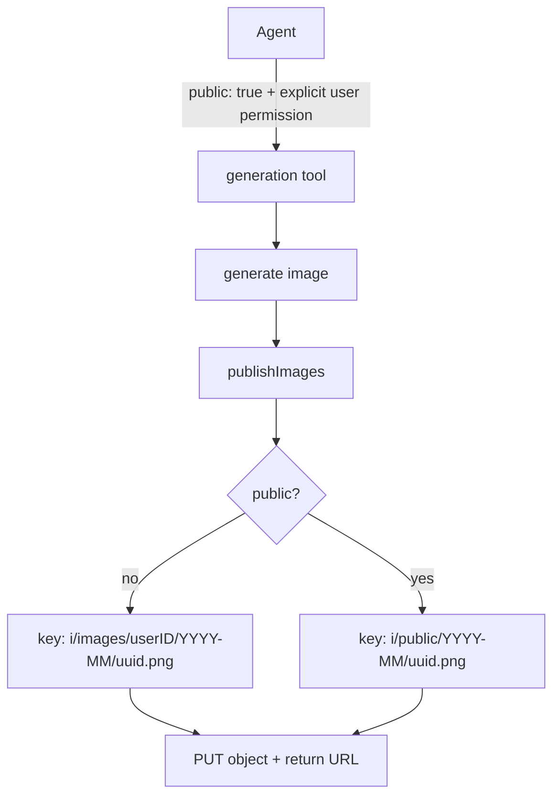

# Public Output Flag Plan

## Goal

Let the image-generating tools (`txt2img`, `img2img`, `bgkill`) optionally publish their output to Garagefront's
world-readable `/i/public/...` namespace, so the result can be opened by anyone without the signed image cookie. The
flag must steer agents away from using it: it is only for when the user has explicitly asked for a public image, and it
must stay off by default, including when a call fails.

## Scope

In scope:

- A `public` boolean input on every tool that produces a file (`txt2img`, `img2img`, `bgkill`).
- An `s3upload` upload path that writes to the `i/public` key prefix instead of the configured user prefix.
- Schema descriptions that carry the warning and the default-to-off instruction.
- Docs and tests.

Out of scope:

- `img2txt` (it returns text, not a file) and `anlas` (it returns a balance), so neither gains the flag.
- Configurable public prefixes; `/i/public/` is a Garagefront convention, so it is a constant.
- Making existing images public, or changing access control at the CDN/Garagefront layer.

## Design

### Flow



### Key mapping

Uploads normally go to `KeyPrefix` (`i/images/<GARAGEFRONT_USER_ID>`), which falls under the LibreChat image cookie.
The public flag instead uses a fixed `i/public` prefix, which Garagefront serves to anyone; no cookie is involved. The
month bucket and UUID filename are unchanged, so keys stay `i/public/<YYYY-MM>/<uuid>.png`.

`resolve.Resolver.objectKey` already treats any `i/...` path as an object key, so public URLs round-trip through the
image tools (`img2img`, `bgkill`, `img2txt`) with no resolver change.

### Where the flag lives

`generationInput` is shared by `txt2img` and `img2img`; `bgkill` has its own input. To avoid duplicating the warning
text, the flag lives in a small embedded `publishInput` struct that both embed. `jsonschema-go` flattens nested
embedded structs through `reflect.VisibleFields`, so the property appears at the top level of each schema.

The flag is a plain `bool` plumbed through `publishImages` into `s3upload.UploadImage`. With no uploader configured the
images are returned inline and the flag has nothing to act on; it is logged but otherwise ignored.

## Non-functional Requirements

- Security: this is a deliberate access-control bypass, so the schema text must be unambiguous about requiring explicit
  user permission and never enabling it to work around failures. `public` is optional and defaults to `false`.
- Performance: no extra work when the flag is off; when on, it is the same single `PutObject` as today.
- Maintainability: one constant, one shared input struct, one boolean parameter; the warning text cannot drift between
  tools because it exists once.
- Observability: every generating tool logs `public` on its `tool called` debug line.

## Implementation Units

### Unit 1: Public upload path in `s3upload`

Files:

- `internal/s3upload/upload.go` (edit)
- `internal/s3upload/upload_test.go` (edit)

API:

```go
// PublicKeyPrefix is the object key prefix Garagefront serves without access checks.
const PublicKeyPrefix = "i/public"

func (u *Client) UploadImage(ctx context.Context, data []byte, public bool) (string, error)
```

Behaviour:

1. `objectKey(public bool)` keeps its current logic, but returns `PublicKeyPrefix + "/" + <YYYY-MM>/<uuid>.png` when
   `public` is true, regardless of `PublicBaseURL`/`KeyPrefix`.
2. When `public` is false, behaviour is unchanged: prefixed key in public-base mode, unprefixed key otherwise.
3. The returned URL follows the existing rules: `PublicBaseURL/<key>` in public-base mode, else a presigned URL.

Acceptance criteria:

- [x] AC-1.1: `UploadImage(ctx, data, false)` reproduces today's keys and returned URLs; the existing presigned and
  public-base URL tests still pass with the added argument.
- [x] AC-1.2: `UploadImage(ctx, data, true)` in public-base mode does a `PUT` to `/{bucket}/i/public/<YYYY-MM>/<uuid>.png`
  and returns `PublicBaseURL/i/public/<YYYY-MM>/<uuid>.png` with no query string.
- [x] AC-1.3: `UploadImage(ctx, data, true)` without a public base URL does a `PUT` to a key under `i/public/` and returns
  a presigned URL (contains `X-Amz-Signature=`).
- [x] AC-1.4: A public upload ignores a configured `KeyPrefix`.
- [x] AC-1.5: `PublicKeyPrefix` is exactly `i/public`.

### Unit 2: `public` flag on the output tools

Files:

- `internal/mcp/shared.go` (edit): `publishInput` embedded in `generationInput`; `publishImages` is in `publish.go`.
- `internal/mcp/publish.go` (edit): pass `public` to `UploadImage`.
- `internal/mcp/txt2img.go`, `internal/mcp/img2img.go`, `internal/mcp/bgkill.go` (edit): set the schema default, log the
  flag, and pass it to `publishImages`.
- `internal/mcp/shared_test.go`, `internal/mcp/bgkill_test.go` (edit), `internal/mcp/publish_test.go` (new).

API:

```go
type publishInput struct {
	Public bool `json:"public,omitempty" jsonschema:"..."`
}

func publishImages(
	ctx context.Context,
	log *zap.Logger,
	tool string,
	images [][]byte,
	public bool,
	uploader *s3upload.Client,
	shortenerClient *shortener.Client,
) (*mcp.CallToolResult, generationOutput, error)
```

Behaviour:

1. `public` defaults to `false` in every schema that has it.
2. The description warns that anyone will be able to view the output, that it needs explicit user permission, and that
   it must stay false even when a call fails and never be used to work around an error.
3. `publishImages` forwards `public` to `UploadImage`; when `uploader` is nil it returns inline content as before.
4. Each handler logs `public` on its `tool called` debug line and passes `in.Public`.

Acceptance criteria:

- [x] AC-2.1: `txt2img`, `img2img`, and `bgkill` schemas contain a boolean `public` property that is optional and
  defaults to `false`.
- [x] AC-2.2: The `public` description states that it needs explicit user permission, that anyone will be able to view
  the output, and that it must be left false on failure; tests assert the keywords `explicit` and `anyone`.
- [x] AC-2.3: `img2txtSchema()` has no `public` property.
- [x] AC-2.4: A `publishImages` test with a real `s3upload.Client` backed by an `httptest` server shows `public=true`
  writing to `/i/public/` and `public=false` writing to the configured prefix, with matching returned URLs.
- [x] AC-2.5: `publishImages` with a nil uploader returns inline `image/png` content regardless of `public`.

### Unit 3: Documentation

Files:

- `README.md` (edit)
- `docs/PROMPT.md` (edit)

Acceptance criteria:

- [x] AC-3.1: The README Garagefront section documents the `public` flag, its effect, and the explicit-permission rule.
- [x] AC-3.2: `docs/PROMPT.md` tells agents not to set `public` unless the user explicitly asks for a publicly viewable
  image.
- [x] AC-3.3: The README stays short and high level.

## Validation

Run from the project root:

```sh
go build ./...
go vet ./...
go test ./... -race -count=1 -coverprofile=coverage.out
```

All three pass. Tests use `httptest` servers and in-memory transports; no live network calls.

## Human Verification

- HV-1: With Garagefront configured, call `txt2img` with `public: true` and open the returned URL in a private browsing
  window with no image cookie set; confirm it loads. Then call again with `public` unset and confirm that URL does not
  load in the same window.
- HV-2: Confirm the public object is stored under the `i/public/` prefix in the bucket.

## Decisions

- The public prefix is an `s3upload` constant rather than config: `/i/public/` is a Garagefront convention and the
  resolver only reads Garagefront URLs anyway.
- `public` is one shared embedded field so the warning text cannot drift between tools.
- The flag is honored whenever an uploader exists; in presigned (non-Garagefront) mode it still changes the object key
  but the URL is a presigned one, which already needs no cookie to open.
- `img2txt` is excluded because it returns text, not a stored file.

## Follow-ups

- Make the public prefix configurable if Garagefront's namespace ever changes.
