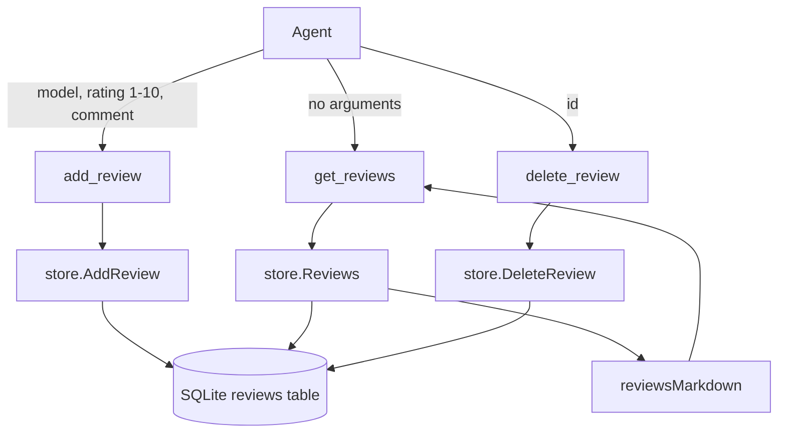

# Reviews Implementation Plan

## Goal

Add a local SQLite-backed model review feature with three MCP tools: `add_review` records a rating from 1 to 10 plus one
line of commentary about a model, `get_reviews` returns every review as Markdown with averages, and `delete_review`
removes a review by id.

This plan also introduces the SQLite client itself. The examples feature adds a second table to the same package and
database, so the database is created and connected to on every startup whether or not either feature is used; see
[`EXAMPLES_PLAN.md`](EXAMPLES_PLAN.md), which depends on this plan.

## Scope

In scope:

- New `internal/store` package owning the SQLite client, the schema, and review persistence.
- Unconditional database creation and connection at startup, plus closing it on shutdown.
- `DB_PATH` configuration, an `mcp.Deps` dependency struct, server wiring, Docker and `.gitignore` changes.
- Three MCP tools, Markdown rendering, docs, and tests.

Out of scope:

- Editing or updating a review; only add and delete are provided.
- Reviews keyed by user, session, or API key; the database belongs to the deployment, not to a caller.
- Validating that a reviewed model exists. The server keeps no model list, so any model string is accepted.
- Examples persistence, `get_examples`, and the `examples` table ([`EXAMPLES_PLAN.md`](EXAMPLES_PLAN.md)).
- Schema migrations after the initial release; see Follow-ups.

## Design

### Database client

Reviews and examples share one database, so they share one client. The store lives in `internal/store` and knows nothing
about MCP; the tools render Markdown from plain structs.

The driver is `modernc.org/sqlite`, which is pure Go. The image is built with `CGO_ENABLED=0` and runs on
`distroless/static-debian12:nonroot`, so a cgo driver (`mattn/go-sqlite3`) is not an option.

- One `*sql.DB` for the process, safe for concurrent tool calls.
- `SetMaxOpenConns(1)` so writes never contend and `SQLITE_BUSY` cannot surface, with a `busy_timeout` pragma as a
  second line of defence.
- `journal_mode(WAL)` set through the DSN, so the pragma applies to every pooled connection.
- The DSN is built as `path + "?_pragma=busy_timeout(5000)&_pragma=journal_mode(WAL)"`. The driver strips the query
  string itself when the name is not a `file:` URI, so a plain filesystem path (including a Windows path) works.

### Data flow



### Schema

```sql
CREATE TABLE IF NOT EXISTS reviews (
    id         INTEGER PRIMARY KEY AUTOINCREMENT,
    model      TEXT    NOT NULL,
    rating     INTEGER NOT NULL CHECK (rating BETWEEN 1 AND 10),
    comment    TEXT    NOT NULL,
    created_at TEXT    NOT NULL
);

CREATE INDEX IF NOT EXISTS reviews_model_id_idx ON reviews (model, id);
```

The schema is applied with `CREATE ... IF NOT EXISTS` statements in a single transaction on every open, so opening an
existing database is idempotent. `created_at` is RFC3339 UTC text and is informational only; ordering is by `id`.

### Package layout

| Path                              | Change | Purpose                                                               |
| --------------------------------- | ------ | --------------------------------------------------------------------- |
| `internal/store/store.go`         | New    | `Client`, `New`, `Close`, DSN building, schema                        |
| `internal/store/store_test.go`    | New    | Open, close, idempotency, and DSN tests                               |
| `internal/store/review.go`        | New    | `Review`, `ErrReviewNotFound`, `AddReview`, `Reviews`, `DeleteReview` |
| `internal/store/review_test.go`   | New    | Review persistence tests                                              |
| `internal/config/config.go`       | Edit   | `DB_PATH`                                                             |
| `internal/config/config_test.go`  | Edit   | `DB_PATH` tests                                                       |
| `internal/mcp/server.go`          | Edit   | `Deps` struct, accept and pass the store                              |
| `internal/mcp/handlers.go`        | Edit   | Hold `store`                                                          |
| `internal/mcp/server_test.go`     | Edit   | `Deps`-based construction                                             |
| `internal/mcp/reviews.go`         | New    | Tool registration, input/output types, handlers, schemas              |
| `internal/mcp/review_markdown.go` | New    | `reviewsMarkdown`                                                     |
| `internal/mcp/reviews_test.go`    | New    | Registration, handler, schema, and Markdown tests                     |
| `internal/server/server.go`       | Edit   | Open and close the store, build `Deps`                                |
| `internal/server/server_test.go`  | Edit   | Temporary `DB_PATH`                                                   |
| `Dockerfile`                      | Edit   | Writable `/data` working directory for the default path               |
| `.gitignore`                      | Edit   | Ignore database files                                                 |
| `.env.example`, `README.md`       | Edit   | Document `DB_PATH` and the tools                                      |

### Configuration

| Env var   | Required | Default      | Purpose                                                                                                |
| --------- | -------- | ------------ | ------------------------------------------------------------------------------------------------------ |
| `DB_PATH` | No       | `neo-mcp.db` | SQLite file path, relative to the process working directory; parent directories are created if missing |

Because the image runs with `/data` as its working directory, the default resolves to `/data/neo-mcp.db` in a
container. There is no enable flag for reviews; the database is always opened, and a failure to open it fails startup.

### Design decisions

1. **Reviews are always on.** Only the examples feature is gated by an environment variable, so the review tools are
   registered whenever the database is available. This is what makes the database unconditional.
2. **Ids are never reused.** `INTEGER PRIMARY KEY AUTOINCREMENT` means a deleted id is not handed out again, so an id an
   agent still holds cannot silently point at a different review.
3. **Commentary is required, and it is one line.** `add_review` rejects an empty comment, a comment containing a newline
   or any control character, and a comment longer than 500 runes. Model names are capped at 200 runes. Validation lives
   in the store (one source of truth) and is mirrored into the tool schema so the agent sees the limits before calling.
4. **Ratings are bounded three times.** The schema carries `minimum: 1` and `maximum: 10`, the store validates in Go, and
   the table has a `CHECK` constraint.
5. **`get_reviews` reports per-model averages as well as the overall average.** Comparing models is the reason to review
   one, so a single global average would not answer the question an agent is asking.
6. **`get_reviews` takes no input and returns everything.** The table is small by nature; there is no filter, no
   pagination, and no ordering option.
7. **`delete_review` returns the deleted review, and an unknown id is an error.** A silent no-op would let an agent
   believe it deleted something it did not.
8. **Several reviews for one model are allowed.** There is no uniqueness constraint, and the per-model average is across
   all of them.
9. **Timestamps are not used for ordering or identity.** Ordering is by `id`, which is monotonic regardless of clock
   changes.
10. **The MCP constructor takes a `Deps` struct.** The parameter list is already at seven positional arguments; the store
    makes it eight and the examples feature makes it nine. A struct keeps call sites readable and makes later additions
    (the examples config) a field addition rather than another rewrite of every call site.
11. **The database path is operator-configured only.** No tool input reaches filesystem or SQL identifiers; every query
    is parameterised.

## Non-functional Requirements

Security:

- Every query uses bound parameters. No SQL is built from tool input.
- Review text is stored verbatim, trimmed of surrounding whitespace, and refused when it contains control characters, so
  a stored review can never break the Markdown document it is rendered into.
- The database path comes from the environment and is never logged with credentials; no secret is stored in the
  database.
- The file and any directory the store creates are created with restrictive permissions where the platform honours them.

Performance:

- One prepared statement per operation; the `(model, id)` index keeps listing and grouping cheap as the table grows.
- `SetMaxOpenConns(1)` removes write contention entirely; each operation is a single short statement.
- `Reviews` reads the whole table in one query and groups in memory, which is appropriate for a table whose size is
  bounded by human review behaviour.

Maintainability:

- `internal/store` has no dependency on MCP, and the MCP layer has no SQL.
- Markdown rendering is a pure function, so formatting is tested without a database or an MCP session.
- The client is injected, so every test runs against a throwaway file in `t.TempDir()`.

## Units

### Unit 1: SQLite store client and `DB_PATH`

Create the store package with the client and schema, then open the database at startup regardless of feature use and
close it on shutdown.

Files:

- `internal/store/store.go` (new)
- `internal/store/store_test.go` (new)
- `internal/config/config.go` (edit), `internal/config/config_test.go` (edit)
- `internal/server/server.go` (edit), `internal/server/server_test.go` (edit)
- `Dockerfile` (edit), `.gitignore` (edit)
- `README.md` (edit)

API:

```go
package store

type Client struct{ /* db *sql.DB */ }

func New(path string) (*Client, error)
func (c *Client) Close() error
func dsn(path string) string

const schema = `...`
```

Behaviour:

1. `New` rejects an empty path.
2. It creates the parent directory with `os.MkdirAll(filepath.Dir(path), 0o750)` when the directory is neither empty nor
   `.`, so a configured path under a missing directory works.
3. It opens the DSN from the configuration table, sets `SetMaxOpenConns(1)`, pings, and applies the schema in a
   transaction.
4. The schema applied here is only the `reviews` table; the examples table is added by the examples plan.
5. A local variable named `store` already exists in `internal/server/server.go` (the `resolve.ObjectStore`); rename it to
   `objectStore` so the import is not shadowed.
6. `server.New` opens the store before building anything else, logs `database opened` with the path, keeps the client on
   `Server`, and returns `open database: %w` on failure. `Server.Shutdown` closes the HTTP server and the store,
   returning `errors.Join` of both errors.
7. The Dockerfile creates a `/data` directory owned by the nonroot user in the build stage, copies it into the final
   stage, and sets it as the working directory, so the default `DB_PATH` is writable in a container. The build must keep
   working with `CGO_ENABLED=0`.

Acceptance criteria:

- [x] AC-1.1: `store.New(filepath.Join(t.TempDir(), "neo.db"))` returns no error, creates the file, and the `reviews` table
      exists (asserted through `sqlite_master`).
- [x] AC-1.2: `store.New("")` returns an error and creates no file.
- [x] AC-1.3: `store.New` creates a missing parent directory: a path two levels inside a fresh temp directory opens
      successfully and the directory exists afterwards.
- [x] AC-1.4: `store.New` on a path whose parent component is an existing regular file fails with a wrapped error and does
      not panic.
- [x] AC-1.5: Opening the same path twice (close, reopen) succeeds and preserves data; the schema statements are idempotent.
- [x] AC-1.6: After `Close`, further use of the client returns an error rather than panicking.
- [x] AC-1.7: `dsn("/tmp/neo.db")` contains the path followed by `?_pragma=busy_timeout(5000)&_pragma=journal_mode(WAL)`,
      and contains no `file:` prefix.
- [x] AC-1.8: The database is in WAL mode: after `New`, a raw `database/sql` connection opened by the test against the same
      file reports `wal` for `PRAGMA journal_mode`.
- [x] AC-1.9: `Load()` reads `DB_PATH`, and the default is `neo-mcp.db` when the variable is unset.
- [x] AC-1.10: `server.New` with `DBPath` in a fresh temp directory returns no error, creates the file, and logs
      `database opened` with that path.
- [x] AC-1.11: `server.New` with an unopenable `DBPath` returns an error containing `open database`.
- [x] AC-1.12: After `Server.Shutdown`, the store is closed: a subsequent query on `srv.store` fails.
- [x] AC-1.13: `internal/server/server_test.go` sets `DBPath` to a temp path and no test creates `neo-mcp.db` in the
      repository working directory.
- [x] AC-1.14: `.gitignore` ignores `*.db`, `*.db-wal`, and `*.db-shm`.
- AC-1.15: `docker build .` succeeds and the resulting image starts without `DB_PATH` set (build verified by the human;
  see HV-4).

### Unit 2: Review persistence

Add the review API to the store package.

Files:

- `internal/store/review.go` (new)
- `internal/store/review_test.go` (new)

API:

```go
var ErrReviewNotFound = errors.New("review not found")

const (
    maxModelLength   = 200
    maxCommentLength = 500
)

type Review struct {
    ID        int64
    Model     string
    Rating    int
    Comment   string
    CreatedAt time.Time
}

func (c *Client) AddReview(ctx context.Context, model string, rating int, comment string) (Review, error)
func (c *Client) Reviews(ctx context.Context) ([]Review, error)
func (c *Client) DeleteReview(ctx context.Context, id int64) (Review, error)
```

Behaviour:

1. `AddReview` trims the model and comment, validates both, validates the rating, inserts `created_at` as RFC3339Nano
   UTC, and returns the stored row with its id.
2. `Reviews` selects every row ordered by `model COLLATE NOCASE` then `id`.
3. `DeleteReview` selects the row inside a transaction, deletes it, and returns it; a missing row returns
   `ErrReviewNotFound` wrapped with the id.
4. Errors are prefixed `store:`.

Acceptance criteria:

- [x] AC-2.1: `AddReview` returns a positive id and a `CreatedAt` within a minute of now, and `Reviews` returns the same
      model, rating, and comment.
- [x] AC-2.2: Ids increase monotonically, and deleting the newest review and adding another does not reuse the deleted id.
- [x] AC-2.3: Ratings 0 and 11 are rejected with an error naming the rating and no row is written; ratings 1 and 10 are
      accepted.
- [x] AC-2.4: An empty or whitespace-only model or comment is rejected; surrounding whitespace is trimmed before storage,
      so `"  cat  "` is stored as `cat`.
- [x] AC-2.5: A comment containing `\n`, `\r`, a tab, or any other control character is rejected and nothing is written.
- [x] AC-2.6: A comment of exactly 500 runes is accepted and one of 501 is rejected; a 500-rune comment of multi-byte
      characters is accepted, proving the limit counts runes, not bytes. The same check applies to a 200-rune model.
- [x] AC-2.7: `Reviews` on an empty database returns an empty, non-nil slice and no error.
- [x] AC-2.8: `Reviews` orders by model case-insensitively then by id ascending; a fixture with models `B`, `a`, and `A`
      returns `a`, `A`, then `B`, with each model's reviews in insertion order.
- [x] AC-2.9: `DeleteReview` returns the deleted review, and deleting the same id again returns an error satisfying
      `errors.Is(err, store.ErrReviewNotFound)`.
- [x] AC-2.10: After `DeleteReview`, `Reviews` no longer contains the row and every other row is unchanged.
- [x] AC-2.11: `DeleteReview(0)` and a negative id return `ErrReviewNotFound` and delete nothing.
- [x] AC-2.12: Eight goroutines adding reviews concurrently all succeed and all rows are present when the test runs with
      `-race`, proving a single connection plus the busy timeout handles concurrent tool calls.
- [x] AC-2.13: Every query is parameterised; no SQL string is assembled from the model, comment, or id.
- [x] AC-2.14: Tests create the database under `t.TempDir()` and close the client in `t.Cleanup`, so no test writes inside
      the repository and cleanup succeeds on Windows while the file was open.

### Unit 3: `mcp.New` dependency struct

Convert the MCP server constructor to a dependency struct, with no behaviour change.

Files:

- `internal/mcp/server.go` (edit)
- `internal/mcp/handlers.go` (edit)
- `internal/mcp/server_test.go` (edit)
- `internal/mcp/img2txt_test.go`, `internal/mcp/anlas_test.go`, `internal/mcp/provider_test.go` (edit)

API:

```go
type Deps struct {
    Log       *zap.Logger
    Forge     *sdwebui.Client
    NovelAI   *novelai.Client
    Uploader  *s3upload.Client
    Shortener *shortener.Client
    Resolver  *resolve.Resolver
    OpenAI    *openai.Client
    Store     *store.Client
}

func New(deps Deps) (*mcp.Server, error)
```

Behaviour:

1. `New` copies `deps` into the `handlers` value that `registerTools` receives, and performs no other work.
2. `handlers` gains a `store *store.Client` field, which Unit 4 uses. `registerTools` is unchanged by this unit, so the
   registered tool set is identical for every combination of non-nil clients.
3. `internal/server/server.go` builds the struct from config.
4. Every existing `New(...)` call site in tests becomes `New(Deps{...})` with the same values.

Acceptance criteria:

- [x] AC-3.1: `New(Deps{})` returns a server and registers no tools.
- [x] AC-3.2: `New(Deps{Forge: x})`, `New(Deps{NovelAI: y})`, and `New(Deps{OpenAI: z})` register exactly the tool sets they
      registered before this unit (`txt2img`/`img2img`/`bgkill`, `txt2img`/`img2img`/`anlas`, and `img2txt` respectively).
- [x] AC-3.3: `Deps.Store` is reachable from the handlers (`handlers.store` equals the value passed).
- [x] AC-3.4: `go test ./...` passes with no test expectations changed other than the constructor call shape.
- [x] AC-3.5: `internal/server/server.go` builds `Deps` from config and still returns `build mcp server: %w` on failure.
- [x] AC-3.6: `Deps` is taken and copied by value, so a caller cannot mutate the server's configuration after construction.

### Unit 4: Review MCP tools

Add `add_review`, `get_reviews`, and `delete_review`.

Files:

- `internal/mcp/reviews.go` (new)
- `internal/mcp/review_markdown.go` (new)
- `internal/mcp/reviews_test.go` (new)
- `internal/mcp/server.go` (edit), `internal/mcp/handlers.go` (edit)
- `internal/server/server.go` (edit)

API:

```go
type addReviewInput struct {
    Model   string `json:"model" jsonschema:"the model being reviewed: a Forge checkpoint filename or a NovelAI model id"`
    Rating  int    `json:"rating" jsonschema:"score from 1 (worst) to 10 (best)"`
    Comment string `json:"comment" jsonschema:"one line of commentary explaining the rating"`
}

type addReviewOutput struct {
    ID      int64  `json:"id" jsonschema:"the new review's id, which delete_review takes"`
    Model   string `json:"model" jsonschema:"the model the review is about"`
    Rating  int    `json:"rating" jsonschema:"the recorded rating"`
    Comment string `json:"comment" jsonschema:"the recorded commentary"`
}

type getReviewsInput struct{}

type getReviewsOutput struct {
    Count   int     `json:"count" jsonschema:"number of reviews"`
    Average float64 `json:"average" jsonschema:"mean rating across all reviews, 0 when there are none"`
}

type deleteReviewInput struct {
    ID int64 `json:"id" jsonschema:"id of the review to delete, as returned by add_review or listed by get_reviews"`
}

type deleteReviewOutput struct {
    ID      int64  `json:"id" jsonschema:"the deleted review's id"`
    Model   string `json:"model" jsonschema:"the model the deleted review was about"`
    Rating  int    `json:"rating" jsonschema:"the deleted rating"`
    Comment string `json:"comment" jsonschema:"the deleted commentary"`
}

func reviewsMarkdown(reviews []store.Review) string
```

Behaviour:

1. `registerTools` registers the three tools when `h.store != nil`, and registers none of them otherwise.
2. The `add_review` schema marks all three fields required, gives `rating` `minimum` 1 and `maximum` 10, and gives
   `model` and `comment` their length limits.
3. `add_review` returns the created review, its text content is
   `Added review <id> for <model>: <rating>/10 - <comment>`, and a validation error becomes a tool error prefixed
   `add_review`.
4. `get_reviews` takes no input, returns `reviewsMarkdown` as a single `TextContent`, and returns the count and overall
   average as structured output. The average is not rounded in structured output; Markdown rounds to one decimal.
5. `delete_review` returns the deleted review, with text `Deleted review <id>: <model> <rating>/10 - <comment>`. An
   unknown id becomes a tool error containing the id and `not found`.
6. Markdown format, with one blank line between blocks:

    ```markdown
    # Reviews

    Average: 7.3/10 (3 reviews)

    ## nai-diffusion-5-full

    Average: 8.5/10 (2 reviews)

    - 9/10 (id 3): Superb hands
    - 8/10 (id 4): A little soft

    ## sd_xl_base_1.0.safetensors

    Average: 6.0/10 (1 review)

    - 6/10 (id 1): Weak textures
    ```

    An empty table renders the single line `No reviews yet.`. Counts use `review` when the count is 1 and `reviews`
    otherwise. Averages are formatted with `%.1f`.

Acceptance criteria:

- [x] AC-4.1: With `Deps.Store` set, listing tools over an in-memory session returns `add_review`, `get_reviews`, and
      `delete_review` in addition to the existing tools; with `Deps.Store` nil, none of the three is present.
- [x] AC-4.2: `add_review` requires `model`, `rating`, and `comment`, with no defaults; `rating` reports `minimum` 1 and
      `maximum` 10; `model` reports `maxLength` 200 and `comment` `maxLength` 500.
- [x] AC-4.3: `get_reviews` has no input properties, and `delete_review` requires `id` with no default.
- [x] AC-4.4: A `CallTool` for `add_review` returns the new id in both the text and the structured content, and the row is
      visible to a following `get_reviews`.
- [x] AC-4.5: A rating of 0 or 11 returns a tool error whose message contains `add_review`, and the table is unchanged.
- [x] AC-4.6: `get_reviews` Markdown matches the format above for a fixture with two models, three reviews, and mixed cases,
      including the overall and per-model counts and averages.
- [x] AC-4.7: On an empty database `get_reviews` returns `No reviews yet.`, `count` 0, and `average` 0.
- [x] AC-4.8: `delete_review` for an existing id removes the row and returns the deleted model, rating, and comment; for an
      unknown id it returns a tool error containing the id and `not found`, and the table is unchanged.
- [x] AC-4.9: `reviewsMarkdown` is tested directly with hand-built slices covering an empty slice, one review, several
      reviews across several models, a multi-byte comment, a comment containing Markdown metacharacters, and mixed-case
      model names that must group case-insensitively.
- [x] AC-4.10: Every tool logs a `tool called` debug entry naming the tool, and `add_review` and `delete_review` log the
      affected id at info level.
- [x] AC-4.11: An end-to-end test with a real store on `t.TempDir()` adds two reviews for different models, lists them,
      deletes one by id, lists again, and asserts the Markdown reflects each step.
- [x] AC-4.12: A store error (a closed client) surfaces as a tool error prefixed with the tool name, not a panic.
- [x] AC-4.13: `server.New` passes the opened store into `Deps`, so a deployed server registers the review tools (asserted by
      AC-1.10 plus AC-4.1).

### Unit 5: Documentation

Files:

- `README.md` (edit)
- `.env.example` (edit)
- `docs/PROMPT.md` (edit)

Acceptance criteria:

- [x] AC-5.1: The README features list gains one bullet describing the three review tools, that ratings are 1-10 with one
      line of commentary, and that they are stored in a local SQLite database.
- [x] AC-5.2: The README mentions `DB_PATH`, that the database is created automatically, and that Docker users should mount a
      volume at `/data` to keep it; the README stays high level and defers detail to `.env.example`.
- [x] AC-5.3: `.env.example` lists `DB_PATH` under a `database` heading with its default and a note that the container path
      is `/data/neo-mcp.db`.
- [x] AC-5.4: `docs/PROMPT.md` gains a short bullet telling the agent to check `get_reviews` before choosing between models
      and to record a rating with `add_review` after a notable result.

## Out of Scope

- Updating a review, or reacting to one.
- Attaching images or example ids to a review.
- Any notion of who wrote a review, or of hiding a review from other callers.
- Model validation or discovery; the reviewed model is an opaque string, matching the NovelAI routing decision.
- Pagination, filtering, or search over reviews.
- Migrations for schema changes after the initial release.

## Validation

Run from the project root:

```sh
go build ./...
go vet ./...
go test ./... -race -count=1 -coverprofile=coverage.out
go tool cover -func=coverage.out
```

`go mod tidy` is required after adding `modernc.org/sqlite` in Unit 1. Every test must be hermetic: databases live under
`t.TempDir()`, no test writes inside the repository, no network access is required, and `go test ./...` must leave no
`neo-mcp.db` behind.

## Human Verification

- HV-1: Start the server with `API_KEY` set and a temporary `DB_PATH`, add a few reviews for different models through a
  real MCP client, then call `get_reviews` and confirm the Markdown renders correctly in that client, including the
  overall and per-model averages.
- HV-2: Restart the server and confirm the reviews are still there, proving the file and path behave as documented.
- HV-3: Delete a review by id from the client and confirm it disappears, then add another review and confirm the deleted
  id is not reused.
- HV-4: Build the image (`docker build .`) and run it with a named volume mounted at `/data` and no `DB_PATH` set;
  confirm it starts, the tools work, and the reviews survive replacing the container. This also covers AC-1.15.
- HV-5: `.env.example` is unreadable for agents under editor privacy settings. The `DB_PATH` entry was appended without
  reading the file; confirm its placement and formatting, and that nothing else in the file needs the same addition.

## Follow-ups

- Add a `PRAGMA user_version` migration step when the schema changes for the first time.
- Consider a `get_reviews` filter or per-model summary if the table ever grows past what one Markdown document can
  usefully show.
- Consider recording the model's rating alongside saved examples, so examples can be ranked rather than sampled
  randomly ([`EXAMPLES_PLAN.md`](EXAMPLES_PLAN.md)).
